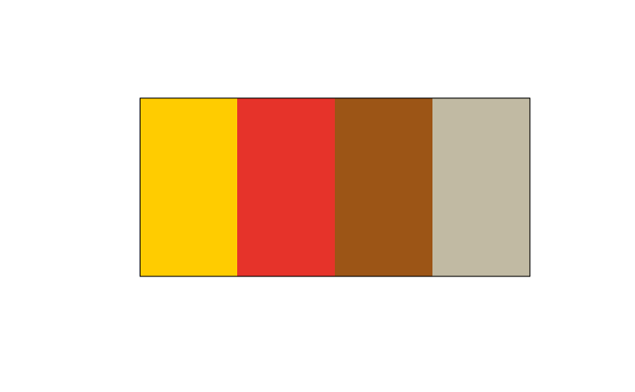

# Using RUB colors

This vignette describes how to display and retrieve the RUB colors and
palettes. For details on using these palettes in ggplot2, see the
separate vignette XXX.

## Colors

`RUBer` provides easy access to the colors as specified in the [RUB
corporate design](https://www.ruhr-uni-bochum.de/cd/). Once the package
is loaded, access all available colors by typing `RUB_colors`. Note that
I assigned that the color names were assigned as part of this package
and are not offically sanctioned by the corporate design guide.

``` r

# Retrieve all available colors
RUB_colors
#>        green     green_80     green_60     green_40     green_20         blue 
#>    "#8DAE10"    "#A4BE40"    "#BBCE70"    "#D1DF9F"    "#E8EFCF"    "#003560" 
#>      blue_80      blue_60      blue_40      blue_20 lighter grey   light grey 
#>    "#335D80"    "#6686A0"    "#99AEBF"    "#CCD7DF"    "#ECECEC"    "#E7E7E7" 
#>          red     dark red       orange         gold        brown          tan 
#>    "#E6332A"    "#B61E3E"    "#ED7102"    "#FFCC00"    "#9C5516"    "#C1BAA3" 
#>   dark brown    asparagus 
#>    "#59201B"    "#8C8751"

# ... access individual color by index
RUB_colors[1]
#>     green 
#> "#8DAE10"

# ... or by name
RUB_colors["dark red"]
#>  dark red 
#> "#B61E3E"
```

To retrieve several colors at once, use the getter function
[`get_RUB_colors()`](../reference/get_RUB_colors.md).

``` r

# Retrieve several colors by name
get_RUB_colors("green", "blue", "orange")
#>     green      blue    orange 
#> "#8DAE10" "#003560" "#ED7102"

# Retrieve several colors by index
get_RUB_colors(4:6, 9)
#>  green_40  green_20      blue   blue_40 
#> "#D1DF9F" "#E8EFCF" "#003560" "#99AEBF"
```

## Palettes

The colors are combined in several palettes. To retrieve all available
palettes, use `RUB_palettes`. To retrieve a particular palette by name,
use the function `get_RUB_palettes` plus the number of required colors
in round brackets like so `get_RUB_palettes(palette = "discrete_5")(5)`.
If the palette contains less elements than requested, additional colors
will automatically be extrapolated.

Note that the RUB colors as defined by the corporate design were not
designed with data visualization in mind. The palettes presented here
are ad-hoc and rather informal, until the corporate design is offically
extended to include visualization design.

``` r


# All availabble palettes
RUB_palettes
#> $discrete
#>     green      blue       red  dark red    orange      gold     brown 
#> "#8DAE10" "#003560" "#E6332A" "#B61E3E" "#ED7102" "#FFCC00" "#9C5516" 
#> 
#> $discrete_contrast
#>      gold       red     brown       tan 
#> "#FFCC00" "#E6332A" "#9C5516" "#C1BAA3" 
#> 
#> $discrete_1
#>     green 
#> "#8DAE10" 
#> 
#> $discrete_2
#>     green      blue 
#> "#8DAE10" "#003560" 
#> 
#> $discrete_3
#>      green light grey       blue 
#>  "#8DAE10"  "#E7E7E7"  "#003560" 
#> 
#> $discrete_4
#>     green  green_60   blue_40      blue 
#> "#8DAE10" "#BBCE70" "#99AEBF" "#003560" 
#> 
#> $discrete_5
#>      green   green_60 light grey    blue_40       blue 
#>  "#8DAE10"  "#BBCE70"  "#E7E7E7"  "#99AEBF"  "#003560" 
#> 
#> $discrete_6
#>     green  green_80  green_40   blue_40   blue_80      blue 
#> "#8DAE10" "#A4BE40" "#D1DF9F" "#99AEBF" "#335D80" "#003560" 
#> 
#> $discrete_7
#>      green   green_80   green_40 light grey    blue_40    blue_80       blue 
#>  "#8DAE10"  "#A4BE40"  "#D1DF9F"  "#E7E7E7"  "#99AEBF"  "#335D80"  "#003560" 
#> 
#> $discrete_8
#>     green  green_80  green_60  green_40   blue_40   blue_60   blue_80      blue 
#> "#8DAE10" "#A4BE40" "#BBCE70" "#D1DF9F" "#99AEBF" "#6686A0" "#335D80" "#003560" 
#> 
#> $continuous
#>     green      blue 
#> "#8DAE10" "#003560" 
#> 
#> $continuous_diverging
#>      green light grey       blue 
#>  "#8DAE10"  "#E7E7E7"  "#003560"

# Retrieve five colors from the palette "discrete_5"
get_RUB_palettes(palette = "discrete_5")(5)
#> [1] "#8DAE10" "#BBCE70" "#E7E7E7" "#99AEBF" "#003560"

# Retrieve ten colors, five of which are extrapolated, from the palette 
# "discrete_5".
get_RUB_palettes(palette = "discrete_5")(10)
#>  [1] "#8DAE10" "#A1BC3A" "#B5CA65" "#C9D697" "#DDE1CC" "#D5DADE" "#B3C1CC"
#>  [8] "#88A0B4" "#446A8A" "#003560"
```

We can visualize all palettes using Emil Hvitfeldt’s excellent
`prismatic` package.

### Plots for the continuous palettes

First off, we have the two continuous palettes, “continuous” and
“continuous_diverging”.

``` r

plot(prismatic::color(RUBer::get_RUB_palettes(palette = "continuous")(100)))
```


``` r


plot(prismatic::color(RUBer::get_RUB_palettes(palette = "continuous_diverging")(100)))
```


### Plots for the numbered discrete palettes

Second, we have all the numbered discrete palettes, which, for example,
were used to display the distribution of answers for the survey items.
numbered discrete palettes are pre-defined up to a total of eight
separate colors, after, it is necessary to rely on extrapolation.

``` r

plot(prismatic::color(get_RUB_palettes(palette = "discrete_1")(1)))
```


``` r

plot(prismatic::color(get_RUB_palettes(palette = "discrete_2")(2)))
```


``` r

plot(prismatic::color(get_RUB_palettes(palette = "discrete_3")(3)))
```


``` r

plot(prismatic::color(get_RUB_palettes(palette = "discrete_4")(4)))
```


``` r

plot(prismatic::color(get_RUB_palettes(palette = "discrete_5")(5)))
```


``` r

plot(prismatic::color(get_RUB_palettes(palette = "discrete_6")(6)))
```


``` r

plot(prismatic::color(get_RUB_palettes(palette = "discrete_7")(7)))
```


``` r

plot(prismatic::color(get_RUB_palettes(palette = "discrete_8")(8)))
```


``` r


# If you need more than eight unique colors, simply increase the number of
# requested colors in the function call like this:
plot(prismatic::color(get_RUB_palettes(palette = "discrete_8")(16)))
```


### Plots for the discrete palettes

Last, I turned most of the unqiue colors in the RUB corporate design
guide into one awfully looking palette simply called “discrete”. Avert
your eyes, if at all possible! The second palette, “discrete_contrast”
has four colors that form a nice contrast to the base RUB colors,
i.e. the Green and Blue.

``` r

plot(prismatic::color(get_RUB_palettes(palette = "discrete")(7)))
```


``` r

plot(prismatic::color(get_RUB_palettes(palette = "discrete_contrast")(4)))
```



## Further Reading

The implementation is heavily indebted to Simon Jackson’s great article
on color palettes for ggplot2. At the moment, the University of Bochum
really does not have anything like a Data Visualization Style Guide.

- [Simon Jackson - Creating corporate colour palettes for
  ggplot2](https://drsimonj.svbtle.com/creating-corporate-colour-palettes-for-ggplot2)
- [Lisa Charlotte Rost - Your Friendly Guide to Colors in Data
  Visualisation](https://blog.datawrapper.de/colorguide/)
- [Emil Hvitfeldt’s Prismatic
  Package](https://emilhvitfeldt.github.io/prismatic/)
- [Emily Riederer’s Rtistic
  Package](https://github.com/emilyriederer/Rtistic)
- [Amy Cesal - What Are Data Visualization Style
  Guidelines](https://medium.com/nightingale/style-guidelines-92ebe166addc)
