# Using the RUB plotting functions

``` r

# Setup
library(RUBer)

# Attempts to register RubFlama font family, if that fails, 
# registers system dependent font for the alias "sans" instead. 
# This font family will be used as a parameter for all plots. 
font_family <- RUBer::register_font_df()
#> Warning: ✖ Font file "RubFlama-Regular.ttf" could not be found
#> ℹ Using fallback font "DejaVuSans" instead
#> This warning is displayed once per session.

# Required to use custom fonts
showtext::showtext_auto()
```

``` r


options(max.print = 1000)

font_family
#> [1] "DejaVu Sans"

sysfonts::font_families()
#> [1] "sans"         "serif"        "mono"         "wqy-microhei" "DejaVu Sans"

print(systemfonts::system_fonts() %>% dplyr::select(1:5), n = 500)
#> # A tibble: 162 × 5
#>     path                                                index name  family style
#>     <chr>                                               <int> <chr> <chr>  <chr>
#>   1 /usr/share/fonts/type1/urw-base35/URWGothic-BookOb…     0 URWG… URW G… Book…
#>   2 /usr/share/fonts/truetype/lato/Lato-ThinItalic.ttf      0 Lato… Lato   Thin…
#>   3 /usr/share/fonts/truetype/liberation/LiberationSan…     0 Libe… Liber… Bold 
#>   4 /usr/share/fonts/truetype/lato/Lato-SemiboldItalic…     0 Lato… Lato   Semi…
#>   5 /usr/share/fonts/type1/urw-base35/NimbusMonoPS-Bol…     0 Nimb… Nimbu… Bold…
#>   6 /usr/share/fonts/truetype/liberation/LiberationMon…     0 Libe… Liber… Bold 
#>   7 /usr/share/fonts/opentype/urw-base35/NimbusRoman-B…     0 Nimb… Nimbu… Bold…
#>   8 /usr/share/fonts/type1/urw-base35/NimbusRoman-Regu…     0 Nimb… Nimbu… Regu…
#>   9 /usr/share/fonts/truetype/lato/Lato-MediumItalic.t…     0 Lato… Lato   Medi…
#>  10 /usr/share/fonts/type1/urw-base35/NimbusRoman-Ital…     0 Nimb… Nimbu… Ital…
#>  11 /usr/share/fonts/type1/urw-base35/NimbusSansNarrow…     0 Nimb… Nimbu… Bold…
#>  12 /usr/share/fonts/type1/urw-base35/D050000L.t1           0 D050… D0500… Regu…
#>  13 /usr/share/fonts/X11/Type1/P052-BoldItalic.pfb          0 P052… P052   Bold…
#>  14 /usr/share/fonts/opentype/urw-base35/NimbusMonoPS-…     0 Nimb… Nimbu… Regu…
#>  15 /usr/share/fonts/opentype/urw-base35/URWBookman-De…     0 URWB… URW B… Demi…
#>  16 /usr/share/fonts/opentype/urw-base35/URWGothic-Boo…     0 URWG… URW G… Book 
#>  17 /usr/share/fonts/opentype/urw-base35/NimbusSans-It…     0 Nimb… Nimbu… Ital…
#>  18 /usr/share/fonts/truetype/dejavu/DejaVuSerif-Itali…     0 Deja… DejaV… Ital…
#>  19 /usr/share/fonts/X11/Type1/URWBookman-DemiItalic.p…     0 URWB… URW B… Demi…
#>  20 /usr/share/fonts/X11/Type1/P052-Bold.pfb                0 P052… P052   Bold 
#>  21 /usr/share/fonts/truetype/liberation/LiberationMon…     0 Libe… Liber… Ital…
#>  22 /usr/share/fonts/truetype/dejavu/DejaVuSansCondens…     0 Deja… DejaV… Cond…
#>  23 /usr/share/fonts/X11/Type1/NimbusSans-Regular.pfb       0 Nimb… Nimbu… Regu…
#>  24 /usr/share/fonts/X11/Type1/NimbusRoman-BoldItalic.…     0 Nimb… Nimbu… Bold…
#>  25 /usr/share/fonts/X11/Type1/Z003-MediumItalic.pfb        0 Z003… Z003   Medi…
#>  26 /usr/share/fonts/truetype/liberation/LiberationSer…     0 Libe… Liber… Bold 
#>  27 /usr/share/fonts/truetype/dejavu/DejaVuSans.ttf         0 Deja… DejaV… Book 
#>  28 /usr/share/fonts/opentype/urw-base35/NimbusSansNar…     0 Nimb… Nimbu… Regu…
#>  29 /usr/share/fonts/X11/Type1/NimbusRoman-Bold.pfb         0 Nimb… Nimbu… Bold 
#>  30 /usr/share/fonts/type1/urw-base35/C059-BdIta.t1         0 C059… C059   Bold…
#>  31 /usr/share/fonts/X11/Type1/NimbusSans-BoldItalic.p…     0 Nimb… Nimbu… Bold…
#>  32 /usr/share/fonts/truetype/lato/Lato-BlackItalic.ttf     0 Lato… Lato   Blac…
#>  33 /usr/share/fonts/truetype/lato/Lato-Medium.ttf          0 Lato… Lato   Medi…
#>  34 /usr/share/fonts/X11/Type1/C059-Italic.pfb              0 C059… C059   Ital…
#>  35 /usr/share/fonts/opentype/urw-base35/C059-Roman.otf     0 C059… C059   Roman
#>  36 /usr/share/fonts/truetype/liberation/LiberationSer…     0 Libe… Liber… Bold…
#>  37 /usr/share/fonts/type1/urw-base35/StandardSymbolsP…     0 Stan… Stand… Regu…
#>  38 /usr/share/fonts/opentype/urw-base35/NimbusSansNar…     0 Nimb… Nimbu… Bold 
#>  39 /usr/share/fonts/opentype/urw-base35/NimbusSansNar…     0 Nimb… Nimbu… Obli…
#>  40 /usr/share/fonts/truetype/lato/Lato-Bold.ttf            0 Lato… Lato   Bold 
#>  41 /usr/share/fonts/truetype/dejavu/DejaVuSerif-Bold.…     0 Deja… DejaV… Bold 
#>  42 /usr/share/fonts/truetype/dejavu/DejaVuSansCondens…     0 Deja… DejaV… Cond…
#>  43 /usr/share/fonts/truetype/liberation/LiberationSer…     0 Libe… Liber… Ital…
#>  44 /usr/share/fonts/X11/Type1/P052-Italic.pfb              0 P052… P052   Ital…
#>  45 /usr/share/fonts/truetype/liberation/LiberationSan…     0 Libe… Liber… Ital…
#>  46 /usr/share/fonts/X11/Type1/StandardSymbolsPS.pfb        0 Stan… Stand… Regu…
#>  47 /usr/share/fonts/opentype/urw-base35/P052-Italic.o…     0 P052… P052   Ital…
#>  48 /usr/share/fonts/X11/Type1/URWGothic-Demi.pfb           0 URWG… URW G… Demi 
#>  49 /usr/share/fonts/X11/Type1/C059-BdIta.pfb               0 C059… C059   Bold…
#>  50 /usr/share/fonts/opentype/urw-base35/NimbusRoman-R…     0 Nimb… Nimbu… Regu…
#>  51 /usr/share/fonts/truetype/liberation/LiberationSan…     0 Libe… Liber… Regu…
#>  52 /usr/share/fonts/truetype/noto/NotoMono-Regular.ttf     0 Noto… Noto … Regu…
#>  53 /usr/share/fonts/truetype/dejavu/DejaVuSansMono.ttf     0 Deja… DejaV… Book 
#>  54 /usr/share/fonts/truetype/lato/Lato-Black.ttf           0 Lato… Lato   Black
#>  55 /usr/share/fonts/type1/urw-base35/C059-Roman.t1         0 C059… C059   Roman
#>  56 /usr/share/fonts/X11/Type1/NimbusMonoPS-Italic.pfb      0 Nimb… Nimbu… Ital…
#>  57 /usr/share/fonts/truetype/noto/NotoSansMono-Regula…     0 Noto… Noto … Regu…
#>  58 /usr/share/fonts/truetype/droid/DroidSansFallbackF…     0 Droi… Droid… Regu…
#>  59 /usr/share/fonts/opentype/urw-base35/NimbusSansNar…     0 Nimb… Nimbu… Bold…
#>  60 /usr/share/fonts/opentype/urw-base35/URWGothic-Dem…     0 URWG… URW G… Demi…
#>  61 /usr/share/fonts/truetype/dejavu/DejaVuSansCondens…     0 Deja… DejaV… Cond…
#>  62 /usr/share/fonts/truetype/dejavu/DejaVuSansMono-Bo…     0 Deja… DejaV… Bold…
#>  63 /usr/share/fonts/truetype/dejavu/DejaVuSerifConden…     0 Deja… DejaV… Cond…
#>  64 /usr/share/fonts/opentype/urw-base35/P052-Roman.otf     0 P052… P052   Roman
#>  65 /usr/share/fonts/truetype/lato/Lato-Hairline.ttf        0 Lato… Lato   Hair…
#>  66 /usr/share/fonts/type1/urw-base35/URWBookman-Demi.…     0 URWB… URW B… Demi 
#>  67 /usr/share/fonts/truetype/noto/NotoColorEmoji.ttf       0 Noto… Noto … Regu…
#>  68 /usr/share/fonts/truetype/dejavu/DejaVuSansMono-Bo…     0 Deja… DejaV… Bold 
#>  69 /usr/share/fonts/X11/Type1/NimbusMonoPS-BoldItalic…     0 Nimb… Nimbu… Bold…
#>  70 /usr/share/fonts/type1/urw-base35/NimbusMonoPS-Reg…     0 Nimb… Nimbu… Regu…
#>  71 /usr/share/fonts/opentype/urw-base35/URWGothic-Dem…     0 URWG… URW G… Demi 
#>  72 /usr/share/fonts/X11/Type1/URWGothic-Book.pfb           0 URWG… URW G… Book 
#>  73 /usr/share/fonts/truetype/lato/Lato-Thin.ttf            0 Lato… Lato   Thin 
#>  74 /usr/share/fonts/type1/urw-base35/URWBookman-DemiI…     0 URWB… URW B… Demi…
#>  75 /usr/share/fonts/truetype/dejavu/DejaVuSans-BoldOb…     0 Deja… DejaV… Bold…
#>  76 /usr/share/fonts/type1/urw-base35/NimbusSans-Itali…     0 Nimb… Nimbu… Ital…
#>  77 /usr/share/fonts/X11/Type1/NimbusRoman-Italic.pfb       0 Nimb… Nimbu… Ital…
#>  78 /usr/share/fonts/truetype/liberation/LiberationSan…     0 Libe… Liber… Bold…
#>  79 /usr/share/fonts/X11/Type1/NimbusSansNarrow-Obliqu…     0 Nimb… Nimbu… Obli…
#>  80 /usr/share/fonts/truetype/dejavu/DejaVuSans-Bold.t…     0 Deja… DejaV… Bold 
#>  81 /usr/share/fonts/opentype/urw-base35/URWBookman-Li…     0 URWB… URW B… Ligh…
#>  82 /usr/share/fonts/truetype/dejavu/DejaVuSans-ExtraL…     0 Deja… DejaV… Extr…
#>  83 /usr/share/fonts/truetype/lato/Lato-Semibold.ttf        0 Lato… Lato   Semi…
#>  84 /usr/share/fonts/X11/Type1/P052-Roman.pfb               0 P052… P052   Roman
#>  85 /usr/share/fonts/X11/Type1/D050000L.pfb                 0 D050… D0500… Regu…
#>  86 /usr/share/fonts/truetype/dejavu/DejaVuSans-Obliqu…     0 Deja… DejaV… Obli…
#>  87 /usr/share/fonts/X11/Type1/NimbusMonoPS-Bold.pfb        0 Nimb… Nimbu… Bold 
#>  88 /usr/share/fonts/truetype/liberation/LiberationMon…     0 Libe… Liber… Bold…
#>  89 /usr/share/fonts/type1/urw-base35/NimbusRoman-Bold…     0 Nimb… Nimbu… Bold…
#>  90 /usr/share/fonts/type1/urw-base35/URWBookman-Light…     0 URWB… URW B… Ligh…
#>  91 /usr/share/fonts/truetype/dejavu/DejaVuSansMono-Ob…     0 Deja… DejaV… Obli…
#>  92 /usr/share/fonts/type1/urw-base35/C059-Italic.t1        0 C059… C059   Ital…
#>  93 /usr/share/fonts/opentype/urw-base35/C059-Italic.o…     0 C059… C059   Ital…
#>  94 /usr/share/fonts/type1/urw-base35/URWGothic-Demi.t1     0 URWG… URW G… Demi 
#>  95 /usr/share/fonts/truetype/lato/Lato-BoldItalic.ttf      0 Lato… Lato   Bold…
#>  96 /usr/share/fonts/X11/Type1/C059-Roman.pfb               0 C059… C059   Roman
#>  97 /usr/share/fonts/X11/Type1/URWBookman-Light.pfb         0 URWB… URW B… Light
#>  98 /usr/share/fonts/truetype/dejavu/DejaVuSansCondens…     0 Deja… DejaV… Cond…
#>  99 /usr/share/fonts/opentype/urw-base35/NimbusMonoPS-…     0 Nimb… Nimbu… Bold…
#> 100 /usr/share/fonts/opentype/urw-base35/C059-BdIta.otf     0 C059… C059   Bold…
#> 101 /usr/share/fonts/type1/urw-base35/NimbusSansNarrow…     0 Nimb… Nimbu… Obli…
#> 102 /usr/share/fonts/type1/urw-base35/NimbusMonoPS-Bol…     0 Nimb… Nimbu… Bold 
#> 103 /usr/share/fonts/opentype/urw-base35/NimbusRoman-B…     0 Nimb… Nimbu… Bold 
#> 104 /usr/share/fonts/truetype/dejavu/DejaVuMathTeXGyre…     0 Deja… DejaV… Regu…
#> 105 /usr/share/fonts/truetype/dejavu/DejaVuSerif.ttf        0 Deja… DejaV… Book 
#> 106 /usr/share/fonts/X11/Type1/NimbusSansNarrow-Regula…     0 Nimb… Nimbu… Regu…
#> 107 /usr/share/fonts/truetype/dejavu/DejaVuSerifConden…     0 Deja… DejaV… Cond…
#> 108 /usr/share/fonts/type1/urw-base35/URWGothic-Book.t1     0 URWG… URW G… Book 
#> 109 /usr/share/fonts/opentype/urw-base35/URWBookman-Li…     0 URWB… URW B… Light
#> 110 /usr/share/fonts/X11/Type1/URWBookman-LightItalic.…     0 URWB… URW B… Ligh…
#> 111 /usr/share/fonts/type1/urw-base35/NimbusSansNarrow…     0 Nimb… Nimbu… Regu…
#> 112 /usr/share/fonts/truetype/liberation/LiberationSer…     0 Libe… Liber… Regu…
#> 113 /usr/share/fonts/X11/Type1/C059-Bold.pfb                0 C059… C059   Bold 
#> 114 /usr/share/fonts/type1/urw-base35/NimbusSans-BoldI…     0 Nimb… Nimbu… Bold…
#> 115 /usr/share/fonts/opentype/urw-base35/P052-BoldItal…     0 P052… P052   Bold…
#> 116 /usr/share/fonts/type1/urw-base35/P052-Roman.t1         0 P052… P052   Roman
#> 117 /usr/share/fonts/type1/urw-base35/P052-BoldItalic.…     0 P052… P052   Bold…
#> 118 /usr/share/fonts/opentype/urw-base35/NimbusSans-Re…     0 Nimb… Nimbu… Regu…
#> 119 /usr/share/fonts/opentype/urw-base35/NimbusSans-Bo…     0 Nimb… Nimbu… Bold…
#> 120 /usr/share/fonts/opentype/urw-base35/Z003-MediumIt…     0 Z003… Z003   Medi…
#> 121 /usr/share/fonts/type1/urw-base35/NimbusSans-Regul…     0 Nimb… Nimbu… Regu…
#> 122 /usr/share/fonts/type1/urw-base35/P052-Italic.t1        0 P052… P052   Ital…
#> 123 /usr/share/fonts/opentype/urw-base35/NimbusSans-Bo…     0 Nimb… Nimbu… Bold 
#> 124 /usr/share/fonts/truetype/lato/Lato-Regular.ttf         0 Lato… Lato   Regu…
#> 125 /usr/share/fonts/type1/urw-base35/NimbusSans-Bold.…     0 Nimb… Nimbu… Bold 
#> 126 /usr/share/fonts/X11/Type1/NimbusSans-Italic.pfb        0 Nimb… Nimbu… Ital…
#> 127 /usr/share/fonts/opentype/urw-base35/P052-Bold.otf      0 P052… P052   Bold 
#> 128 /usr/share/fonts/truetype/lato/Lato-HairlineItalic…     0 Lato… Lato   Hair…
#> 129 /usr/share/fonts/type1/urw-base35/URWBookman-Light…     0 URWB… URW B… Light
#> 130 /usr/share/fonts/opentype/urw-base35/NimbusMonoPS-…     0 Nimb… Nimbu… Bold 
#> 131 /usr/share/fonts/X11/Type1/NimbusSans-Bold.pfb          0 Nimb… Nimbu… Bold 
#> 132 /usr/share/fonts/truetype/dejavu/DejaVuSerifConden…     0 Deja… DejaV… Cond…
#> 133 /usr/share/fonts/truetype/lato/Lato-LightItalic.ttf     0 Lato… Lato   Ligh…
#> 134 /usr/share/fonts/X11/Type1/NimbusMonoPS-Regular.pfb     0 Nimb… Nimbu… Regu…
#> 135 /usr/share/fonts/type1/urw-base35/NimbusSansNarrow…     0 Nimb… Nimbu… Bold 
#> 136 /usr/share/fonts/X11/Type1/NimbusSansNarrow-Bold.p…     0 Nimb… Nimbu… Bold 
#> 137 /usr/share/fonts/opentype/urw-base35/NimbusMonoPS-…     0 Nimb… Nimbu… Ital…
#> 138 /usr/share/fonts/X11/Type1/URWGothic-BookOblique.p…     0 URWG… URW G… Book…
#> 139 /usr/share/fonts/type1/urw-base35/P052-Bold.t1          0 P052… P052   Bold 
#> 140 /usr/share/fonts/opentype/urw-base35/NimbusRoman-I…     0 Nimb… Nimbu… Ital…
#> 141 /usr/share/fonts/X11/Type1/NimbusRoman-Regular.pfb      0 Nimb… Nimbu… Regu…
#> 142 /usr/share/fonts/truetype/lato/Lato-Italic.ttf          0 Lato… Lato   Ital…
#> 143 /usr/share/fonts/truetype/lato/Lato-Light.ttf           0 Lato… Lato   Light
#> 144 /usr/share/fonts/truetype/lato/Lato-HeavyItalic.ttf     0 Lato… Lato   Heav…
#> 145 /usr/share/fonts/truetype/dejavu/DejaVuSerifConden…     0 Deja… DejaV… Cond…
#> 146 /usr/share/fonts/X11/Type1/URWGothic-DemiOblique.p…     0 URWG… URW G… Demi…
#> 147 /usr/share/fonts/type1/urw-base35/Z003-MediumItali…     0 Z003… Z003   Medi…
#> 148 /usr/share/fonts/truetype/noto/NotoSansMono-Bold.t…     0 Noto… Noto … Bold 
#> 149 /usr/share/fonts/type1/urw-base35/NimbusMonoPS-Ita…     0 Nimb… Nimbu… Ital…
#> 150 /usr/share/fonts/type1/urw-base35/URWGothic-DemiOb…     0 URWG… URW G… Demi…
#> 151 /usr/share/fonts/type1/urw-base35/C059-Bold.t1          0 C059… C059   Bold 
#> 152 /usr/share/fonts/X11/Type1/NimbusSansNarrow-BoldOb…     0 Nimb… Nimbu… Bold…
#> 153 /usr/share/fonts/opentype/urw-base35/URWGothic-Boo…     0 URWG… URW G… Book…
#> 154 /usr/share/fonts/opentype/urw-base35/C059-Bold.otf      0 C059… C059   Bold 
#> 155 /usr/share/fonts/truetype/lato/Lato-Heavy.ttf           0 Lato… Lato   Heavy
#> 156 /usr/share/fonts/truetype/dejavu/DejaVuSerif-BoldI…     0 Deja… DejaV… Bold…
#> 157 /usr/share/fonts/X11/Type1/URWBookman-Demi.pfb          0 URWB… URW B… Demi 
#> 158 /usr/share/fonts/truetype/liberation/LiberationMon…     0 Libe… Liber… Regu…
#> 159 /usr/share/fonts/opentype/urw-base35/StandardSymbo…     0 Stan… Stand… Regu…
#> 160 /usr/share/fonts/opentype/urw-base35/URWBookman-De…     0 URWB… URW B… Demi 
#> 161 /usr/share/fonts/type1/urw-base35/NimbusRoman-Bold…     0 Nimb… Nimbu… Bold 
#> 162 /usr/share/fonts/opentype/urw-base35/D050000L.otf       0 D050… D0500… Regu…
```

The plotting functions in RUBer do not extend the functionality provided
by [ggplot2](https://ggplot2.tidyverse.org) itself. By preconfiguring a
lot of the parameters, though, RUBer’s plotting functions are meant to
be more accessible and easier to use. One of the inspirations for this
was the `bbplot` package used by the data team at BBC News.

## Figure Types

Available figure types:

1.  Vertical stacked bar charts
2.  Vertical stacked bar charts scaled to 100%
3.  Horizontal stacked bar charts scaled to 100%
4.  Line Chart
5.  A combination of vertical stacked bar charts (type 1) with line
    charts (type 4)

### Technical note on font sizes and text rendering

The default settings of theplot functions are optimized for the
corporate design font, RUB Flama, and [Windows Enhanced Metafile
(EMF)](https://en.wikipedia.org/wiki/Windows_Metafile) as output format.
Unfortunately, RUB Flama is not publicly available and cannot be made
accessible to the Github server rendering this document and creating the
example figures. In addition, the images in this document use a raster
format, PNG, created by the [ragg](https://ragg.r-lib.org) device,
rather than the EMF vector format created by
[devEMF](https://github.com/plfjohnson/devEMF). Practically, all of this
means that the default settings of the RUBer package do not work well
for HTML output, including this document. You are not seeing the
intended font, nor do the text sizes match what one would get in
Microsoft Word.

### Figure Type 1 - Vertical stacked bar charts

For plotting vertical stacked bar charts, we use
[`RUBer::rub_plot_type_1`](../reference/rub_plot_type_1.md). Three
variable names are mandatory: `x_var` for the x-coordinate, `y_var` for
the y-coordinate and `fill_var` for the fill variable, which determines
the groups to be stacked. Consider this example:

``` r


# Create test values for all three mandatory variables (x_var, y_var, fill_var).
df_t1_ex1 <- tibble::tribble(
  ~term, ~students, ~degree,
  "Spring '13", 120, "Bachelor 1-Subject",
  "Spring '14", 105, "Bachelor 1-Subject",
  "Spring '15", 124, "Bachelor 1-Subject",
  "Spring '16", 114, "Bachelor 1-Subject",
  "Spring '17", 122, "Bachelor 1-Subject",
  "Spring '13", 121, "Master 1-Subject",
  "Spring '14", 129, "Master 1-Subject",
  "Spring '15", 122, "Master 1-Subject",
  "Spring '16", 168, "Master 1-Subject",
  "Spring '17", 7, "Master 1-Subject",
)

# x_var is mapped to term, y_var to students, and the fill_var to degree.
# base_size increases the text sizes from the default, 11, to 14. The font
# family is changed from "RubFlama" to "sans" (available on all systems).
rub_plot_type_1(
  df = df_t1_ex1,
  x_var = term,
  y_var = students,
  fill_var = degree,
  base_size = 14,
  base_family = "sans"
)
```

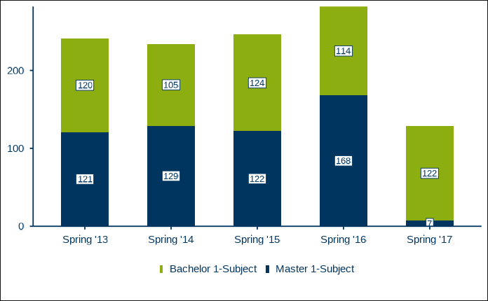

Next a more complex example, in which we additionally provide the label
for the y-axis, `y_axis_label` and a caption indicating the source of
the data, `caption`. By default, the caption has the German prefix
“*Quelle:*”, which we change to English “*Source:*” using the parameter
`caption_prefix`. We also want to suppress the value label for Master
students in the spring term of 2017, because the value is so small. By
default, labels for values accounting for less than 4% of the total
value are suppressed. In this case, the seven students account for
7/(7+122) = 5.4% of the total value, so we increase the value for
`filter_cutoff` from the default of 0.04 to 0.06.

``` r

# Create test values for all three mandatory variables (x_var, y_var, fill_var).
df_t1_ex2 <- tibble::tribble(
   ~term, ~students, ~degree,
   "Spring '13", 120, "Bachelor 1-Subject",
   "Spring '14", 105, "Bachelor 1-Subject",
   "Spring '15", 124, "Bachelor 1-Subject",
   "Spring '16", 114, "Bachelor 1-Subject",
   "Spring '17", 122, "Bachelor 1-Subject",
   "Spring '13", 121, "Master 1-Subject",
   "Spring '14", 129, "Master 1-Subject",
   "Spring '15", 122, "Master 1-Subject",
   "Spring '16", 168, "Master 1-Subject",
   "Spring '17", 7, "Master 1-Subject"
)

# Set values for parameters setting the y-axis title, captioning the source data
# and filtering small value labels (all labels below 6% of the stacked total).
RUBer::rub_plot_type_1(
  df = df_t1_ex2,
  x_var = term,
  y_var = students,
  fill_var = degree,
  y_axis_label = stringr::str_wrap(
    "Students (1st degree program, 1st and 2nd field of study)",
    width = 35
  ),
  caption = "Vignette example data",
  caption_prefix = "Source:",
  filter_cutoff = 0.06,
  base_size = 14,
  base_family = font_family
)
```

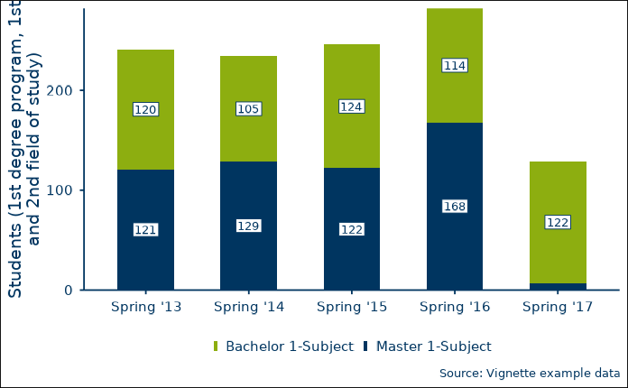

The third example adds even more parameters. You can facet the figure by
a discrete variable, `facet_var`, in order to make direct comparisons
between groups, e.g. different departments. You can also change a
figure’s default color with `color`, the default font with
`base_family`, and the size of all text elements with `base_size` (see
the documentation for
[`RUBer::theme_rub()`](../reference/theme_rub.md)).

``` r

# Create test values for all three mandatory variables (x_var, y_var, fill_var)
# and the optional facet variable (facet_var).
df_t1_ex3 <- tibble::tribble(
   ~term, ~students, ~degree, ~department, 
   "Spring '13", 120, "Bachelor 1-Subject", "Department of Mathematics and Statistics",
   "Spring '14", 105, "Bachelor 1-Subject", "Department of Mathematics and Statistics",
   "Spring '15", 124, "Bachelor 1-Subject", "Department of Mathematics and Statistics",
   "Spring '16", 114, "Bachelor 1-Subject", "Department of Mathematics and Statistics",
   "Spring '17", 122, "Bachelor 1-Subject", "Department of Mathematics and Statistics",
   "Spring '13", 121, "Master 1-Subject", "Department of Mathematics and Statistics",
   "Spring '14", 129, "Master 1-Subject", "Department of Mathematics and Statistics",
   "Spring '15", 122, "Master 1-Subject", "Department of Mathematics and Statistics",
   "Spring '16", 168, "Master 1-Subject", "Department of Mathematics and Statistics",
   "Spring '17", 7, "Master 1-Subject", "Department of Mathematics and Statistics",
   "Spring '13", 44, "Bachelor 1-Subject", "Department of Philosophy",
   "Spring '14", 55, "Bachelor 1-Subject", "Department of Philosophy",
   "Spring '15", 60, "Bachelor 1-Subject", "Department of Philosophy",
   "Spring '16", 40, "Bachelor 1-Subject", "Department of Philosophy",
   "Spring '17", 35, "Bachelor 1-Subject", "Department of Philosophy",
   "Spring '13", 90, "Master 1-Subject", "Department of Philosophy",
   "Spring '14", 95, "Master 1-Subject", "Department of Philosophy",
   "Spring '15", 88, "Master 1-Subject", "Department of Philosophy",
   "Spring '16", 85, "Master 1-Subject", "Department of Philosophy",
   "Spring '17", 92, "Master 1-Subject", "Department of Philosophy"
)

# Facet by department, which effectively leads to two plots in one figure. 
# The main color is changed from RUB blue to dark red, and the size is increased
# from 11 to 14.
rub_plot_type_1(
  df = df_t1_ex3,
  x_var = term,
  y_var = students,
  fill_var = degree,
  y_axis_label = stringr::str_wrap(
    string = "Students (1st degree program, 1st and 2nd field of study)",
    width = 35
  ),
  caption = "Vignette example data",
  caption_prefix = "Source:",
  filter_cutoff = 0.06,
  facet_var = department,
  color = RUB_colors["dark red"],
  base_family = font_family,
  base_size = 14
)
```

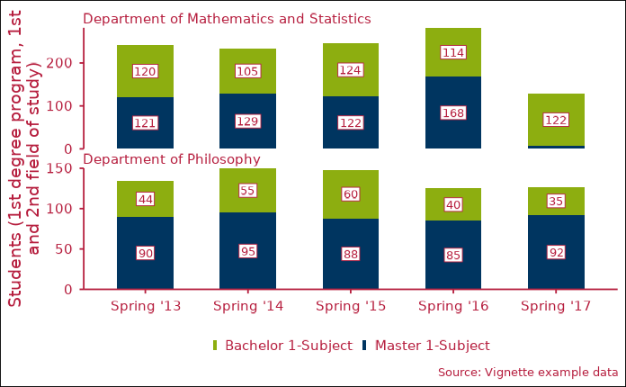

### Figure Type 2 - Vertical stacked bar charts scaled to 100%

Figure type 2, plotted with
[`RUBer::rub_plot_type_2`](../reference/rub_plot_type_2.md), is very
similar to type 1. The main differences are that the y-axis uses a
percentage scale rather than an absolute one and that all stacked bars
are scaled to 100%. Like for figure type 1, three variable names are
mandatory: `x_var` for the x-coordinate, `y_var` for the y-coordinate
and `fill_var` for the fill variable, which determines the groups to be
stacked.

``` r


# Create test data for all three mandatory variables (x_var, y_var, fill_var)
df_t2_ex1 <- tibble::tribble(
  ~cohort_term,     ~status_percentage,               ~cohort_status,
  "2. cohort term",              0.951,                   "Studying",
  "2. cohort term",              0.003,            "Changed subject",
  "2. cohort term",                  0,                  "Graduated",
  "2. cohort term",              0.019, "Disenrolled without degree",
  "2. cohort term",              0.027,            "Dropped subject",
  "4. cohort term",               0.89,                   "Studying",
  "4. cohort term",              0.062,            "Changed subject",
  "4. cohort term",              0.002,                  "Graduated",
  "4. cohort term",               0.02, "Disenrolled without degree",
  "4. cohort term",              0.027,            "Dropped subject",
  "6. cohort term",               0.79,                   "Studying",
  "6. cohort term",               0.15,            "Changed subject",
  "6. cohort term",              0.007,                  "Graduated",
  "6. cohort term",              0.024, "Disenrolled without degree",
  "6. cohort term",              0.028,            "Dropped subject",
  "8. cohort term",              0.612,                   "Studying",
  "8. cohort term",              0.296,            "Changed subject",
  "8. cohort term",               0.01,                  "Graduated",
  "8. cohort term",              0.027, "Disenrolled without degree",
  "8. cohort term",              0.054,            "Dropped subject"
)

rub_plot_type_2(
  df = df_t2_ex1,
  x_var = cohort_term,
  y_var = status_percentage,
  fill_var = cohort_status,
  base_family = "sans"
)
```

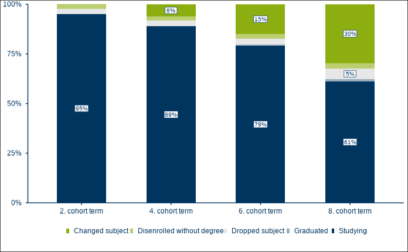

Now let us say we are unhappy with the default ordering of the stacked
bars, because we want the largest cohort group, those still studying, on
top. We can use the boolean parameter `fill_reverse` to do just that. We
also provide a discrete facetting variable, `facet_var`, a text for
`caption` and `caption_prefix`, and a higher threshhold for the
`filter_cutoff`, leading to fewer labels being displayed.

``` r

df_t2_ex2 <- tibble::tribble(
   ~cohort_term, ~status_percentage, ~cohort_status, ~cohort_label, 
   "2. cohort term", 0.9513551740, "Studying", "Bachelor 1-Subject: Starting cohort fall 2011 (n=222)",
   "2. cohort term", 0.0029748098, "Changed subject", "Bachelor 1-Subject: Starting cohort fall 2011 (n=222)",
   "2. cohort term", 0.0004673679, "Graduated", "Bachelor 1-Subject: Starting cohort fall 2011 (n=222)",
   "2. cohort term", 0.0186648938, "Disenrolled without degree", "Bachelor 1-Subject: Starting cohort fall 2011 (n=222)",
   "2. cohort term", 0.0265377545, "Dropped subject", "Bachelor 1-Subject: Starting cohort fall 2011 (n=222)",
   "4. cohort term", 0.8896149868, "Studying", "Bachelor 1-Subject: Starting cohort fall 2011 (n=222)",
   "4. cohort term", 0.0616919929, "Changed subject", "Bachelor 1-Subject: Starting cohort fall 2011 (n=222)",
   "4. cohort term", 0.0016484686, "Graduated", "Bachelor 1-Subject: Starting cohort fall 2011 (n=222)",
   "4. cohort term", 0.0201024499, "Disenrolled without degree", "Bachelor 1-Subject: Starting cohort fall 2011 (n=222)",
   "4. cohort term", 0.0269421019, "Dropped subject", "Bachelor 1-Subject: Starting cohort fall 2011 (n=222)",
   "6. cohort term", 0.7901183540, "Studying", "Bachelor 1-Subject: Starting cohort fall 2011 (n=222)",
   "6. cohort term", 0.1502641318, "Changed subject", "Bachelor 1-Subject: Starting cohort fall 2011 (n=222)",
   "6. cohort term", 0.0074548056, "Graduated", "Bachelor 1-Subject: Starting cohort fall 2011 (n=222)",
   "6. cohort term", 0.0243490259, "Disenrolled without degree", "Bachelor 1-Subject: Starting cohort fall 2011 (n=222)",
   "6. cohort term", 0.0278136827, "Dropped subject", "Bachelor 1-Subject: Starting cohort fall 2011 (n=222)",
   "8. cohort term", 0.6115873010, "Studying", "Bachelor 1-Subject: Starting cohort fall 2011 (n=222)",
   "8. cohort term", 0.2961468339, "Changed subject", "Bachelor 1-Subject: Starting cohort fall 2011 (n=222)",
   "8. cohort term", 0.0104080044, "Graduated", "Bachelor 1-Subject: Starting cohort fall 2011 (n=222)",
   "8. cohort term", 0.0274549015, "Disenrolled without degree", "Bachelor 1-Subject: Starting cohort fall 2011 (n=222)",
   "8. cohort term", 0.0544029593, "Dropped subject", "Bachelor 1-Subject: Starting cohort fall 2011 (n=222)",
   "2. cohort term", 0.769899396, "Studying", "Bachelor 1-Subject: Starting cohort fall 2012 (n=240)",
   "2. cohort term", 0.173399178, "Changed subject", "Bachelor 1-Subject: Starting cohort fall 2012 (n=240)",
   "2. cohort term", 0.034702328, "Graduated", "Bachelor 1-Subject: Starting cohort fall 2012 (n=240)",
   "2. cohort term", 0.006062833, "Disenrolled without degree", "Bachelor 1-Subject: Starting cohort fall 2012 (n=240)",
   "2. cohort term", 0.015936266, "Dropped subject", "Bachelor 1-Subject: Starting cohort fall 2012 (n=240)",
   "4. cohort term", 0.769421630, "Studying", "Bachelor 1-Subject: Starting cohort fall 2012 (n=240)",
   "4. cohort term", 0.173700319, "Changed subject", "Bachelor 1-Subject: Starting cohort fall 2012 (n=240)",
   "4. cohort term", 0.034742910, "Graduated", "Bachelor 1-Subject: Starting cohort fall 2012 (n=240)",
   "4. cohort term", 0.006156721, "Disenrolled without degree", "Bachelor 1-Subject: Starting cohort fall 2012 (n=240)",
   "4. cohort term", 0.015978420, "Dropped subject", "Bachelor 1-Subject: Starting cohort fall 2012 (n=240)",
   "6. cohort term", 0.667217426, "Studying", "Bachelor 1-Subject: Starting cohort fall 2012 (n=240)",
   "6. cohort term", 0.228271544, "Changed subject", "Bachelor 1-Subject: Starting cohort fall 2012 (n=240)",
   "6. cohort term", 0.065634578, "Graduated", "Bachelor 1-Subject: Starting cohort fall 2012 (n=240)",
   "6. cohort term", 0.010729695, "Disenrolled without degree", "Bachelor 1-Subject: Starting cohort fall 2012 (n=240)",
   "6. cohort term", 0.028146757, "Dropped subject", "Bachelor 1-Subject: Starting cohort fall 2012 (n=240)",
   "8. cohort term", 0.511075289, "Studying", "Bachelor 1-Subject: Starting cohort fall 2012 (n=240)",
   "8. cohort term", 0.353166732, "Changed subject", "Bachelor 1-Subject: Starting cohort fall 2012 (n=240)",
   "8. cohort term", 0.073315208, "Graduated", "Bachelor 1-Subject: Starting cohort fall 2012 (n=240)",
   "8. cohort term", 0.026374195, "Disenrolled without degree", "Bachelor 1-Subject: Starting cohort fall 2012 (n=240)",
   "8. cohort term", 0.036068576, "Dropped subject", "Bachelor 1-Subject: Starting cohort fall 2012 (n=240)",
)

rub_plot_type_2(
  df = df_t2_ex2,
  x_var = cohort_term,
  y_var = status_percentage,
  fill_var = cohort_status,
  facet_var = cohort_label,
  filter_cutoff = 0.06,
  caption = "Comparison of two fictitious cohorts",
  caption_prefix = "Source:",
  fill_reverse = TRUE,
  base_size = 14,
  base_family = font_family
)
```

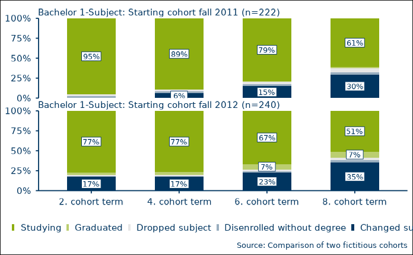

### Figure Type 3 - Horizontal stacked bar charts scaled to 100%

Figure type 3, plotted with
[`RUBer::rub_plot_type_3`](../reference/rub_plot_type_3.md), is very
similar to figure type 2, with the exception that the stacked bar charts
are plotted horizontally. As with the first two figure types, three
variable names are mandatory: `x_var` for the x-coordinate, `y_var` for
the y-coordinate and `fill_var` for the fill variable, which determines
the groups to be stacked.

``` r


# Create test data for all three mandatory variables (x_var, y_var,
# fill_var)
df_t3_ex1 <- tibble::tribble(
  ~survey_group,                                             ~item_value, ~item_value_percentage,
  "Bachelor 1-Subject (n=400)",    "Exceeded prescribed period of study",                    0.3,
  "Bachelor 1-Subject (n=400)",      "Within prescribed period of study",                    0.7,
  "SG Bachelor 1-Subject (n=669)", "Exceeded prescribed period of study",                   0.11,
  "SG Bachelor 1-Subject (n=669)",   "Within prescribed period of study",                   0.89
)

rub_plot_type_3(
   df = df_t3_ex1,
   x_var = item_value_percentage,
   y_var = survey_group,
   fill_var = item_value,
   base_family = "sans"
)
#> Warning in dev_string_widths_c(as.character(strings), as.character(family), :
#> devEMF: your system substituted font family 'DejaVu Sans' when you requested
#> 'sans_systemfonts'
```

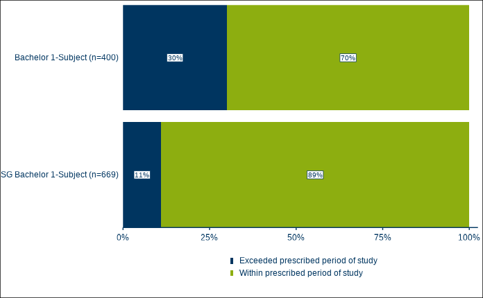

The second example once again adds a facetting variable, `fill_var`, for
plotting direct comparisons between groups. We also use `caption`,
`caption_prefix`, a `filter_cutoff` that suppresses all values below
20%, and increase the text size to 14.

``` r

df_t3_ex2 <- tibble::tribble(
   ~survey_group, ~item_value, ~item_value_percentage, ~degree,
   "Bachelor 1-Subject (n=400)", "Exceeded prescribed period of study", 0.30, "Bachelor 1-Subject",
   "Bachelor 1-Subject (n=400)", "Within prescribed period of study", 0.60, "Bachelor 1-Subject",
   "SG Bachelor 1-Subject (n=726)", "Exceeded prescribed period of study", 0.1122486, "Bachelor 1-Subject",
   "SG Bachelor 1-Subject (n=726)", "Within prescribed period of study", 0.8877514, "Bachelor 1-Subject",
   "Master 1-Subject (n=369)", "Exceeded prescribed period of study", 0.1416009, "Master 1-Subject",
   "Master 1-Subject (n=369)", "Within prescribed period of study", 0.8583991, "Master 1-Subject",
   "SG Master 1-Subject (n=669)", "Exceeded prescribed period of study", 0.4417682, "Master 1-Subject",
   "SG Master 1-Subject (n=669)", "Within prescribed period of study", 0.5582318, "Master 1-Subject"
)

rub_plot_type_3(
   df = df_t3_ex2,
   x_var = item_value_percentage,
   y_var = survey_group,
   fill_var = item_value,
   facet_var = degree,
   caption = "Graduate survey 2017/18",
   caption_prefix = "Source:",
   filter_cutoff = 0.20,
   base_size = 14,
   base_family = font_family
)
#> Warning in dev_string_widths_c(as.character(strings), as.character(family), :
#> devEMF: your system substituted font family 'DejaVu Sans' when you requested
#> 'DejaVu Sans_systemfonts'
```


#### Changing ordering

In the last example above, the ordering of the fill variable,
item_value, is going from bad (“Exceeded prescribed period of study”) to
good (“Within prescribed period of study”). This is because, by default,
the fill variable will be ordered alphabetically if not a factor. So
what if we want the fill variable ordered the other way? We can use the
optional boolean parameter `fill_reverse` to change the ordering of the
the fill variable and of the legend.

``` r

# Reversed fill, reversed legend
rub_plot_type_3(
   df = df_t3_ex2,
   x_var = item_value_percentage,
   y_var = survey_group,
   fill_var = item_value,
   facet_var = degree,
   caption = "Graduate survey 2017/18",
   caption_prefix = "Source:",
   filter_cutoff = 0.20,
   base_size = 14,
   base_family = font_family,
   fill_reverse = TRUE
)
```

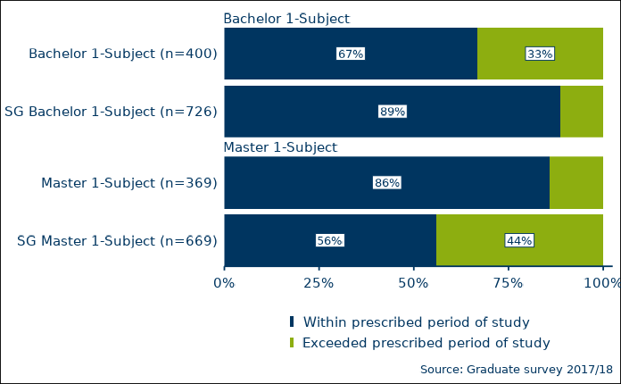

If we simply want to reverse the order of the legend items, without
actually reversing the order of the stacked bar segments, we can use the
optional parameter `legend_reverse` instead.

``` r

# Reversed legend
rub_plot_type_3(
   df = df_t3_ex2,
   x_var = item_value_percentage,
   y_var = survey_group,
   fill_var = item_value,
   facet_var = degree,
   caption = "Graduate survey 2017/18",
   caption_prefix = "Source:",
   filter_cutoff = 0.20,
   base_size = 14,
   base_family = font_family,
   legend_reverse = TRUE
)
```

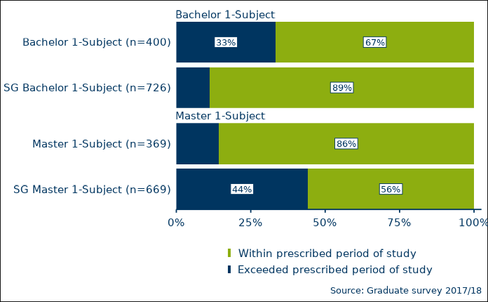

What if we want to use a custom ordering of the fill variable? Consider
the following example:

``` r

df_t3_ex4 <- tibble::tribble(
   ~survey_group, ~item_value, ~item_value_percentage, ~degree,
   "Bachelor 1-Subject (n=400)", "Exceeded prescribed period of study", 0.30, "Bachelor 1-Subject",
   "Bachelor 1-Subject (n=400)", "Within prescribed period of study", 0.60, "Bachelor 1-Subject",
      "Bachelor 1-Subject (n=400)", "Unknown", 0.10, "Bachelor 1-Subject",
   "SG Bachelor 1-Subject (n=726)", "Exceeded prescribed period of study", 0.11, "Bachelor 1-Subject",
   "SG Bachelor 1-Subject (n=726)", "Within prescribed period of study", 0.77, "Bachelor 1-Subject",
      "SG Bachelor 1-Subject (n=726)", "Unknown", 0.12, "Bachelor 1-Subject",
   "Master 1-Subject (n=369)", "Exceeded prescribed period of study", 0.12, "Master 1-Subject",
   "Master 1-Subject (n=369)", "Within prescribed period of study", 0.83, "Master 1-Subject",
      "Master 1-Subject (n=369)", "Unknown", 0.04, "Master 1-Subject",
   "SG Master 1-Subject (n=669)", "Exceeded prescribed period of study", 0.44, "Master 1-Subject",
   "SG Master 1-Subject (n=669)", "Within prescribed period of study", 0.50, "Master 1-Subject",
   "SG Master 1-Subject (n=669)", "Unknown", 0.05, "Master 1-Subject"
)

rub_plot_type_3(
   df = df_t3_ex4,
   x_var = item_value_percentage,
   y_var = survey_group,
   fill_var = item_value,
   facet_var = degree,
   caption = "Graduate survey 2017/18",
   caption_prefix = "Source:",
   base_size = 14,
   base_family = font_family
)
```

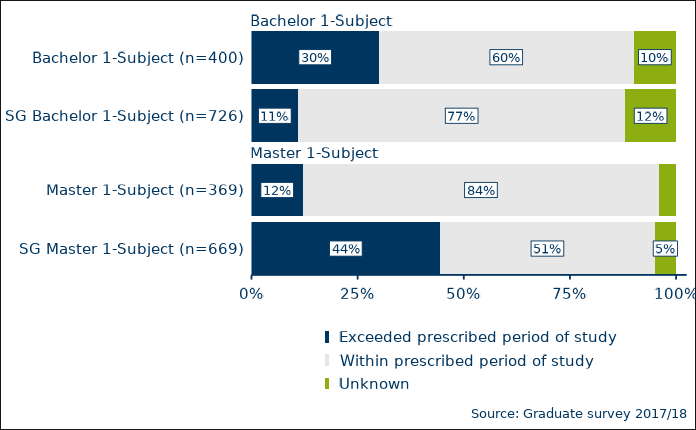

Here, we neither want alphabetic ordering, nor its reverse. Instead, we
would prefer an alphabetic ordering with the item_value “Unknown” always
coming last. For this, we can explicitly turn the `fill_var` into a
factor with a predetermined ordering. The plotting function will respect
this ordering.

``` r

# Take the data from previous example
df_t3_ex5 <- df_t3_ex4

# Turn the column "item_value" into a factor
df_t3_ex5[["item_value"]] <- factor(df_t3_ex5[["item_value"]])

# Examine the levels, default is alphabetic ordering
levels(df_t3_ex5[["item_value"]])
#> [1] "Exceeded prescribed period of study" "Unknown"                            
#> [3] "Within prescribed period of study"

# Make sure that level unknown always comes last
df_t3_ex5[["item_value"]] <- forcats::fct_relevel(
   df_t3_ex5[["item_value"]],
   c("Unknown"),
   after = Inf
)

# Check new ordering
levels(df_t3_ex5[["item_value"]])
#> [1] "Exceeded prescribed period of study" "Within prescribed period of study"  
#> [3] "Unknown"

# Plot
rub_plot_type_3(
   df = df_t3_ex5,
   x_var = item_value_percentage,
   y_var = survey_group,
   fill_var = item_value,
   facet_var = degree,
   caption = "Graduate survey 2017/18",
   caption_prefix = "Source:",
   base_size = 14,
   base_family = font_family
)
```


### Figure Type 4 - Line Charts

``` r


# Create test data for all three mandatory variables (x_var, y_var,
# group_var)
df_t4_ex1 <- tibble::tribble(
  ~term,        ~students,              ~degree,
  "Spring '13",       110, "Bachelor 1-Subject",
  "Spring '14",       105, "Bachelor 1-Subject",
  "Spring '15",       124, "Bachelor 1-Subject",
  "Spring '16",       114, "Bachelor 1-Subject",
  "Spring '17",       140, "Bachelor 1-Subject",
  "Spring '13",       121,   "Master 1-Subject",
  "Spring '14",       129,   "Master 1-Subject",
  "Spring '15",       135,   "Master 1-Subject",
  "Spring '16",       168,   "Master 1-Subject",
  "Spring '17",         7,   "Master 1-Subject"
)

rub_plot_type_4(
  df = df_t4_ex1,
  x_var = term,
  y_var = students,
  group_var = degree,
  y_axis_label = stringr::str_wrap(
    string = "Students (1st degree program, 1st and 2nd field of study)",
    width = 35
  ),
  caption = "Vignette example data",
  caption_prefix = "Source:",
  base_family = "sans"
)
```

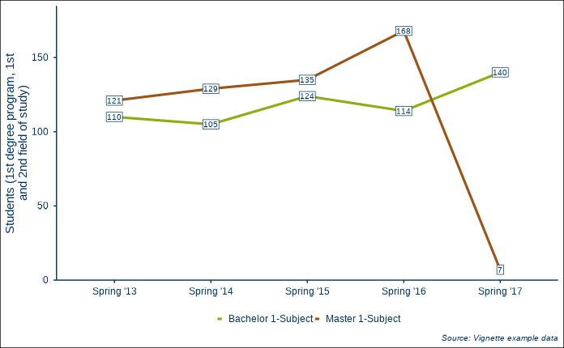

### Figure Type 1 and 4 - Vertical Stacked Bar Charts Combined with Line Charts

``` r


df_t1_and_t4_ex1 <- tibble::tribble(
  ~term,        ~students,              ~degree,              ~group, ~figure_type_id,
  "Spring '13",       120, "Bachelor 1-Subject",                  NA,              1L,
  "Spring '14",       105, "Bachelor 1-Subject",                  NA,              1L,
  "Spring '15",       124, "Bachelor 1-Subject",                  NA,              1L,
  "Spring '16",       114, "Bachelor 1-Subject",                  NA,              1L,
  "Spring '17",       122, "Bachelor 1-Subject",                  NA,              1L,
  "Spring '13",       121,   "Master 1-Subject",                  NA,              1L,
  "Spring '14",       129,   "Master 1-Subject",                  NA,              1L,
  "Spring '15",       122,   "Master 1-Subject",                  NA,              1L,
  "Spring '16",       168,   "Master 1-Subject",                  NA,              1L,
  "Spring '17",         7,   "Master 1-Subject",                  NA,              1L,
  "Spring '13",        20,                   NA, "Freshman students",              4L,
  "Spring '14",        30,                   NA, "Freshman students",              4L,
  "Spring '15",        41,                   NA, "Freshman students",              4L,
  "Spring '16",        27,                   NA, "Freshman students",              4L,
  "Spring '17",        35,                   NA, "Freshman students",              4L
)

rub_plot_type_1_and_4(
  df = df_t1_and_t4_ex1,
  x_var = term,
  y_var = students,
  fill_var = degree,
  group_var = group,
  base_family = "sans"
)
```

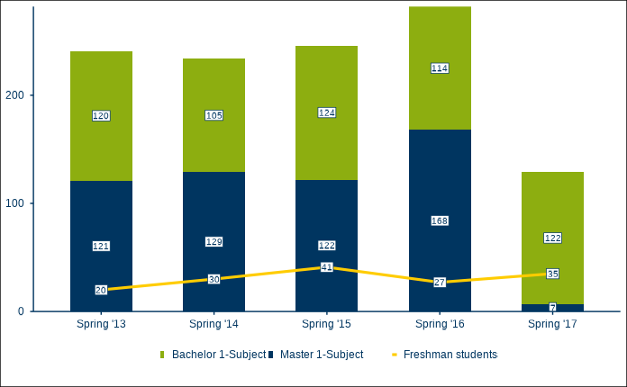

## For experienced ggplot2 users

The level of flexibility and customizability achievable through the
plotting functions of RUBer are limited. At some point, it makes more
sense to properly learn [ggplot2](https://ggplot2.tidyverse.org) and to
use the individual components directly (scales, colors, etc.). See the
[resources section](#resources) for help on getting started with
[ggplot2](https://ggplot2.tidyverse.org).

### Applying the RUB Theme

The function `theme_rub` is a normal
[`ggplot2::theme()`](https://ggplot2.tidyverse.org/reference/theme.html)
function based on
[`ggplot2::theme_minimal()`](https://ggplot2.tidyverse.org/reference/ggtheme.html).
You can use it for any ggplot object:

``` r

# Base plot
ggplot2::ggplot(
   data = mtcars,
   ggplot2::aes(
      x = mpg,
      y = disp,
      color = as.factor(carb)
   )
) + 
   ggplot2::geom_point() +
   theme_rub(
     base_family = font_family
   )
```

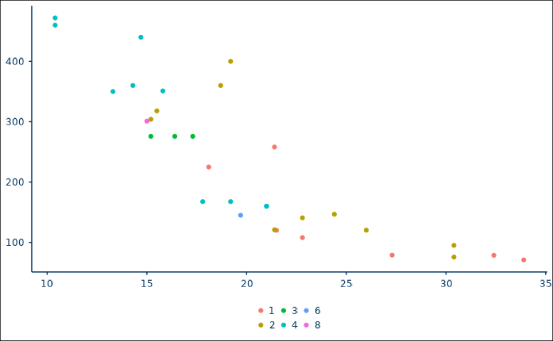

### Scale Functions

The RUB palettes are used through corresponding scale functions.
Currently, (1) `scale_color_rub` (a wrapper for
[`ggplot2::discrete_scale()`](https://ggplot2.tidyverse.org/reference/discrete_scale.html)
if discrete, or for
[`ggplot2::scale_color_gradientn()`](https://ggplot2.tidyverse.org/reference/scale_gradient.html)
if continuous) and (2) `scale_fill_rub` (a wrapper for
[`ggplot2::discrete_scale()`](https://ggplot2.tidyverse.org/reference/discrete_scale.html)
if discrete, or for
[`ggplot2::scale_fill_gradientn()`](https://ggplot2.tidyverse.org/reference/scale_gradient.html)
if continuous) are implemented. Use these scale functions to ensure that
appropriate RUB palettes and colors are used.

``` r

# Basic themed plot with discrete scale function
ggplot2::ggplot(
   data = mtcars,
   ggplot2::aes(
      x = mpg,
      y = disp,
      color = as.factor(carb)
      )
   ) + 
   ggplot2::geom_point(
     size = 3
   ) +
   scale_color_rub(
      palette = "discrete"
   ) +
   theme_rub(
     base_size = 14,
     base_family = font_family
   )
```

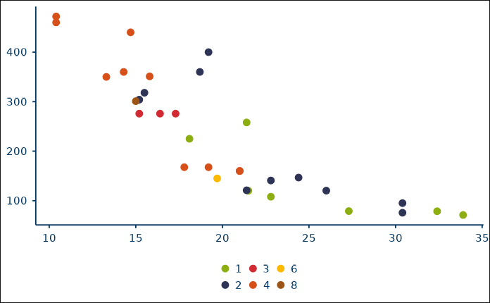

``` r


# By default, the theme shows no axis labels and no legend title. Use the 
# boolean parameters x_axis_label, y_axis_label and legend_title to activate 
# them.
ggplot2::ggplot(
   data = mtcars,
   ggplot2::aes(
      x = mpg,
      y = disp,
      color = as.factor(carb)
   )
) + 
   ggplot2::geom_point(
     size = 3
   ) +
   scale_color_rub(
      palette = "discrete"
   ) +
   theme_rub(
      base_size = 14,
      base_family = font_family,
      x_axis_label = TRUE,
      y_axis_label = TRUE,
      legend_title = FALSE
   )
```

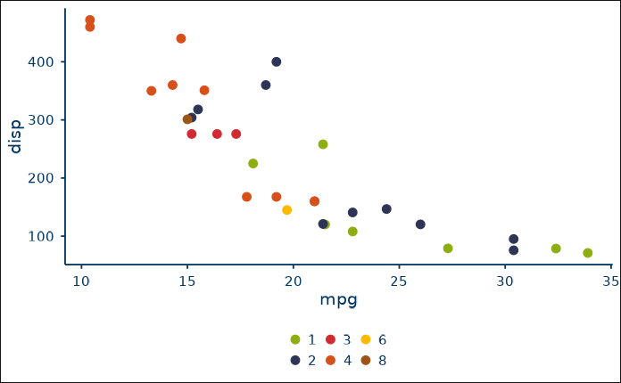

``` r


# Reverse the color palette by setting reverse to TRUE in the scale function
ggplot2::ggplot(
   data = mtcars,
   ggplot2::aes(
      x = mpg,
      y = disp,
      color = as.factor(carb)
   )
) + 
   ggplot2::geom_point(
     size = 3
   ) +
   scale_color_rub(
      palette = "discrete",
      reverse = TRUE
   ) +
   theme_rub(
      base_size = 14,
      base_family = font_family,
      x_axis_label = TRUE,
      y_axis_label = TRUE,
      legend_title = FALSE
   )
```

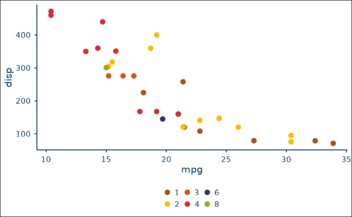

Continuous scales are used by setting `discrete` to `FALSE` and by
providing the name of a continuous palette to `palette` (see
[`vignette("RUB_colors")`](../articles/RUB_colors.md)).

``` r

# Basic plot with continuous scale function
ggplot2::ggplot(
   data = mtcars,
   ggplot2::aes(
      x = mpg,
      y = disp,
      color = disp
   )
) + 
   ggplot2::geom_point(
     size = 3
   ) +
   scale_color_rub(
      palette = "continuous",
      discrete = FALSE
   ) +
   theme_rub(
      base_size = 14,
      base_family = font_family,
      x_axis_label = TRUE,
      y_axis_label = TRUE,
      legend_title = TRUE
   )
```

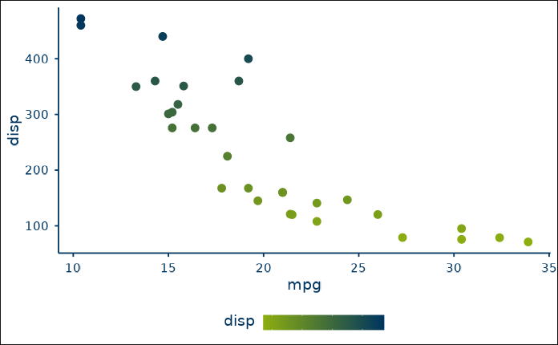

``` r


# Reverse the color palette by setting reverse to TRUE in the scale function
ggplot2::ggplot(
   data = mtcars,
   ggplot2::aes(
      x = mpg,
      y = disp,
      color = disp
   )
) + 
   ggplot2::geom_point(
     size = 3
   ) +
   scale_color_rub(
      palette = "continuous",
      discrete = FALSE,
      reverse = TRUE
   ) +
   theme_rub(
      base_size = 14,
      base_family = font_family,
      x_axis_label = TRUE,
      y_axis_label = TRUE,
      legend_title = TRUE
   )
```

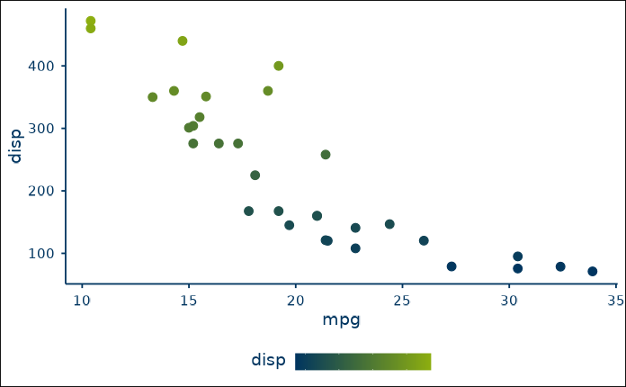

``` r


# Example of continuous_diverging palette
ggplot2::ggplot(
   data = mtcars,
   ggplot2::aes(
      x = mpg,
      y = disp,
      color = disp
   )
) + 
   ggplot2::geom_point(
     size = 3
   ) +
   scale_color_rub(
      palette = "continuous_diverging",
      discrete = FALSE
   ) +
   theme_rub(
      base_size = 14,
      base_family = font_family,
      x_axis_label = TRUE,
      y_axis_label = TRUE,
      legend_title = TRUE
   )
```

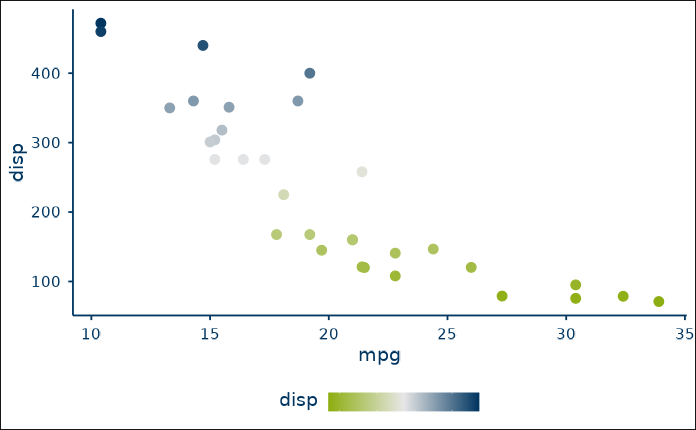

``` r

ggplot2::ggplot(
   data = mtcars,
   ggplot2::aes(
      x = as.factor(gear),
      fill = as.factor(vs)
      )
   ) + 
   ggplot2::geom_bar() +
   scale_fill_rub(
      palette = "discrete_2"
   ) + 
   theme_rub(
      base_size = 14,
      base_family = font_family,
      x_axis_label = TRUE,
      y_axis_label = TRUE,
      legend_title = TRUE
   )
```

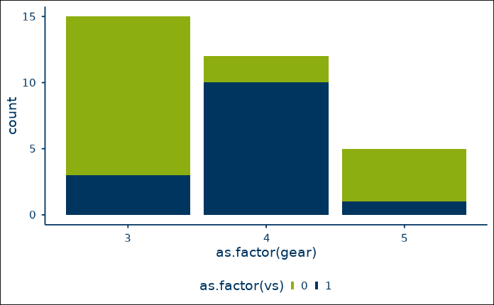

``` r

# Turn off showtext after plotting
showtext::showtext_auto(FALSE)
```

## Resources for learning ggplot2

### Books

1.  The [Data
    visualisation](https://r4ds.had.co.nz/data-visualisation.html) and
    [Graphics for
    communication](https://r4ds.had.co.nz/graphics-for-communication.html)
    chapters in [R for Data Science](https://r4ds.had.co.nz) by Garrett
    Grolemund and Hadley Wickham,
2.  The [R Graphics Cookbook, 2nd Edition](https://r-graphics.org/) by
    Winston Chang,
3.  [Data Visualization - A practical introduction](http://socviz.co/)
    by Kieran Healy,
4.  [ggplot2 - Elegant Graphics for Data Analysis, 3rd
    Edition](https://ggplot2-book.org/) by Hadley Wickham.

### Presentations and tutorials

1.  [Designing ggplots - making clear figures that
    communicate](https://designing-ggplots.netlify.com/) by Malcolm
    Barrett,
2.  [A ggplot2 Tutorial for Beautiful Plotting in
    R](https://cedricscherer.netlify.com/2019/08/05/a-ggplot2-tutorial-for-beautiful-plotting-in-r/)
    by Cédric Scherer,
3.  [Step-by-step examples of building publication-quality figures in
    ggplot2](https://github.com/clauswilke/practical_ggplot2) by Claus
    Wilke,
4.  [A Gentle Guide to the Grammar of Graphics with
    ggplot2](https://www.garrickadenbuie.com/talk/trug-ggplot2/) by
    Garrick Aden-Buie.

### Interactive courses

- The [R Studio Cloud Primer on
  ggplot2](https://rstudio.cloud/learn/primers/3).

### Further Reading

- [BBC - bbplot package](https://github.com/bbc/bbplot)
- [BBC Visual and Data Journalism cookbook for R
  graphics](https://bbc.github.io/rcookbook/)
- [Dewey Dunnington at rstudio::conf 2020 - Best practices for
  programming with
  ggplot2](https://resources.rstudio.com/rstudio-conf-2020/best-practices-for-programming-with-ggplot2-dewey-dunnington)
- [gglot 2 vignette - Using ggplot2 in
  packages](https://ggplot2.tidyverse.org/dev/articles/ggplot2-in-packages.html)
