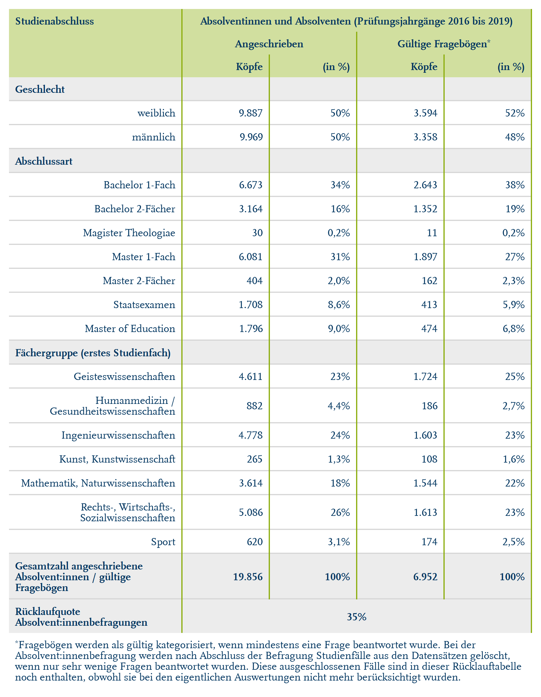

# Get formatted flextable of response rates for the Absolvent:innenbefragung

Get formatted flextable of response rates for the
Absolvent:innenbefragung

## Usage

``` r
rub_table_ab(df, typology, headings, padding = 3L)
```

## Arguments

- df:

  Data frame

- typology:

  Data frame with flextable typology

- headings:

  Character vectors of headings

- padding:

  Integer, padding in pts (points) passed to
  [`flextable::padding()`](https://davidgohel.github.io/flextable/reference/padding.html)

## Value

Formatted Flextable

## Illustrations



## Examples

``` r
# Create example data
studienabschluss <- data.frame(
  stringsAsFactors = FALSE,
  studienabschluss = c("Geschlecht","weiblich",
                       "m\u00E4nnlich","Abschlussart","Bachelor 1-Fach",
                       "Bachelor 2-F\u00E4cher","Staatsexamen","Magister Theologiae",
                       "Master 1-Fach","Master 2-F\u00E4cher","Master of Education",
                       "F\u00E4chergruppe (erstes Studienfach)","Geisteswissenschaften",
                       "Humanmedizin / Gesundheitswissenschaften",
                       "Ingenieurwissenschaften","Kunst, Kunstwissenschaft",
                       "Mathematik, Naturwissenschaften",
                       "Rechts-, Wirtschafts-, Sozialwissenschaften","Sport",
                       "Gesamtzahl angeschriebene Absolvent:innen / g\u00FCltige Frageb\u00F6gen",
                       "R\u00FCcklaufquote Absolvent:innenbefragungen"),
  koepfe_rub = c(NA,"9.887","9.969",NA,
                 "6.673","3.164","1.708","30","6.081","404","1.796",NA,
                 "4.611","882","4.778","265","3.614","5.086","620",
                 "19.856","35%"),
  koepfe_rub_perc = c(NA,"50%","50%",NA,"34%",
                      "16%","8,6%","0,2%","31%","2,0%","9,0%",NA,"23%",
                      "4,4%","24%","1,3%","18%","26%","3,1%","100%","35%"),
  koepfe_bef = c(NA,"3.594","3.358",NA,
                 "2.643","1.352","413","11","1.897","162","474",NA,
                 "1.724","186","1.603","108","1.544","1.613","174",
                 "6.952","35%"),
  koepfe_bef_perc = c(NA,"52%","48%",NA,"38%",
                      "19%","5,9%","0,2%","27%","2,3%","6,8%",NA,"25%",
                      "2,7%","23%","1,6%","22%","23%","2,5%","100%","35%"),
  row_id = c(1L,2L,3L,4L,5L,6L,7L,8L,
             9L,10L,11L,12L,13L,14L,15L,16L,17L,18L,19L,
             20L,21L)
)

typology <- data.frame(
  stringsAsFactors = FALSE,
  col_keys = c(
    "studienabschluss","koepfe_rub","koepfe_rub_perc","koepfe_bef","koepfe_bef_perc"
  ),
  colC = c(
    "Studienabschluss","Absolventinnen und Absolventen (Pr\u00FCfungsjahrg\u00E4nge 2016 bis 2019)",
    "Absolventinnen und Absolventen (Pr\u00FCfungsjahrg\u00E4nge 2016 bis 2019)",
    "Absolventinnen und Absolventen (Pr\u00FCfungsjahrg\u00E4nge 2016 bis 2019)",
    "Absolventinnen und Absolventen (Pr\u00FCfungsjahrg\u00E4nge 2016 bis 2019)"
  ),
  colB = c(
    "Studienabschluss","Angeschrieben","Angeschrieben","G\u00FCltige Frageb\u00F6gen",
    "G\u00FCltige Frageb\u00F6gen"
  ),
  colA = c(
    "Studienabschluss","K\u00F6pfe","(in %)","K\u00F6pfe","(in %)"
  )
)

headings <- c(
  "Geschlecht", "Abschlussart", "F\u00E4chergruppe (erstes Studienfach)",
  "Gesamtzahl angeschriebene Absolvent:innen / g\u00FCltige Frageb\u00F6gen",
  "R\u00FCcklaufquote Absolvent:innenbefragungen"
)

# Function call
rub_table_ab(
  df = studienabschluss,
  typolog = typology,
  headings = headings
)


.cl-a3350f92{}.cl-a32cc0da{font-family:'RUB Scala TZ';font-size:9pt;font-weight:bold;font-style:normal;text-decoration:none;color:rgba(0, 53, 96, 1.00);background-color:transparent;}.cl-a32cc0e4{font-family:'RUB Scala TZ';font-size:5.4pt;font-weight:bold;font-style:normal;text-decoration:none;color:rgba(0, 53, 96, 1.00);background-color:transparent;vertical-align:super;}.cl-a32cc0ee{font-family:'RUB Scala TZ';font-size:9pt;font-weight:normal;font-style:normal;text-decoration:none;color:rgba(0, 53, 96, 1.00);background-color:transparent;}.cl-a32cc0ef{font-family:'RUB Scala TZ';font-size:5.4pt;font-weight:normal;font-style:normal;text-decoration:none;color:rgba(0, 53, 96, 1.00);background-color:transparent;vertical-align:super;}.cl-a32fa872{margin:0;text-align:left;border-bottom: 0 solid rgba(0, 0, 0, 1.00);border-top: 0 solid rgba(0, 0, 0, 1.00);border-left: 0 solid rgba(0, 0, 0, 1.00);border-right: 0 solid rgba(0, 0, 0, 1.00);padding-bottom:5pt;padding-top:5pt;padding-left:5pt;padding-right:5pt;line-height: 1;background-color:transparent;}.cl-a32fa87c{margin:0;text-align:center;border-bottom: 0 solid rgba(0, 0, 0, 1.00);border-top: 0 solid rgba(0, 0, 0, 1.00);border-left: 0 solid rgba(0, 0, 0, 1.00);border-right: 0 solid rgba(0, 0, 0, 1.00);padding-bottom:5pt;padding-top:5pt;padding-left:5pt;padding-right:5pt;line-height: 1;background-color:transparent;}.cl-a32fa886{margin:0;text-align:right;border-bottom: 0 solid rgba(0, 0, 0, 1.00);border-top: 0 solid rgba(0, 0, 0, 1.00);border-left: 0 solid rgba(0, 0, 0, 1.00);border-right: 0 solid rgba(0, 0, 0, 1.00);padding-bottom:5pt;padding-top:5pt;padding-left:5pt;padding-right:5pt;line-height: 1;background-color:transparent;}.cl-a32fa887{margin:0;text-align:left;border-bottom: 0 solid rgba(0, 0, 0, 1.00);border-top: 0 solid rgba(0, 0, 0, 1.00);border-left: 0 solid rgba(0, 0, 0, 1.00);border-right: 0 solid rgba(0, 0, 0, 1.00);padding-bottom:3pt;padding-top:3pt;padding-left:3pt;padding-right:3pt;line-height: 1;background-color:transparent;}.cl-a32fa890{margin:0;text-align:right;border-bottom: 0 solid rgba(0, 0, 0, 1.00);border-top: 0 solid rgba(0, 0, 0, 1.00);border-left: 0 solid rgba(0, 0, 0, 1.00);border-right: 0 solid rgba(0, 0, 0, 1.00);padding-bottom:3pt;padding-top:3pt;padding-left:3pt;padding-right:3pt;line-height: 1;background-color:transparent;}.cl-a32fa891{margin:0;text-align:center;border-bottom: 0 solid rgba(0, 0, 0, 1.00);border-top: 0 solid rgba(0, 0, 0, 1.00);border-left: 0 solid rgba(0, 0, 0, 1.00);border-right: 0 solid rgba(0, 0, 0, 1.00);padding-bottom:3pt;padding-top:3pt;padding-left:3pt;padding-right:3pt;line-height: 1;background-color:transparent;}.cl-a32fa892{margin:0;text-align:left;border-bottom: 0 solid rgba(0, 0, 0, 1.00);border-top: 0 solid rgba(0, 0, 0, 1.00);border-left: 0 solid rgba(0, 0, 0, 1.00);border-right: 0 solid rgba(0, 0, 0, 1.00);padding-bottom:5pt;padding-top:5pt;padding-left:5pt;padding-right:5pt;line-height: 1;background-color:transparent;}.cl-a32fd16c{width:2in;background-color:rgba(209, 223, 159, 1.00);vertical-align: top;border-bottom: 0 solid rgba(0, 0, 0, 1.00);border-top: 0 solid rgba(0, 0, 0, 1.00);border-left: 0 solid rgba(0, 0, 0, 1.00);border-right: 1pt solid rgba(141, 174, 16, 1.00);margin-bottom:0;margin-top:0;margin-left:0;margin-right:0;}.cl-a32fd176{width:1in;background-color:rgba(209, 223, 159, 1.00);vertical-align: top;border-bottom: 0 solid rgba(0, 0, 0, 1.00);border-top: 0 solid rgba(0, 0, 0, 1.00);border-left: 1pt solid rgba(141, 174, 16, 1.00);border-right: 1pt solid rgba(141, 174, 16, 1.00);margin-bottom:0;margin-top:0;margin-left:0;margin-right:0;}.cl-a32fd177{width:1in;background-color:rgba(209, 223, 159, 1.00);vertical-align: top;border-bottom: 0 solid rgba(0, 0, 0, 1.00);border-top: 0 solid rgba(0, 0, 0, 1.00);border-left: 1pt solid rgba(141, 174, 16, 1.00);border-right: 1pt solid rgba(141, 174, 16, 1.00);margin-bottom:0;margin-top:0;margin-left:0;margin-right:0;}.cl-a32fd178{width:2in;background-color:rgba(236, 236, 236, 1.00);vertical-align: middle;border-bottom: 1pt solid rgba(215, 215, 215, 1.00);border-top: 0 solid rgba(0, 0, 0, 1.00);border-left: 0 solid rgba(0, 0, 0, 1.00);border-right: 1pt solid rgba(141, 174, 16, 1.00);margin-bottom:0;margin-top:0;margin-left:0;margin-right:0;}.cl-a32fd180{width:1in;background-color:rgba(236, 236, 236, 1.00);vertical-align: middle;border-bottom: 1pt solid rgba(215, 215, 215, 1.00);border-top: 0 solid rgba(0, 0, 0, 1.00);border-left: 1pt solid rgba(141, 174, 16, 1.00);border-right: 1pt solid rgba(141, 174, 16, 1.00);margin-bottom:0;margin-top:0;margin-left:0;margin-right:0;}.cl-a32fd181{width:2in;background-color:transparent;vertical-align: middle;border-bottom: 1pt solid rgba(215, 215, 215, 1.00);border-top: 1pt solid rgba(215, 215, 215, 1.00);border-left: 0 solid rgba(0, 0, 0, 1.00);border-right: 1pt solid rgba(141, 174, 16, 1.00);margin-bottom:0;margin-top:0;margin-left:0;margin-right:0;}.cl-a32fd18a{width:1in;background-color:transparent;vertical-align: middle;border-bottom: 1pt solid rgba(215, 215, 215, 1.00);border-top: 1pt solid rgba(215, 215, 215, 1.00);border-left: 1pt solid rgba(141, 174, 16, 1.00);border-right: 1pt solid rgba(141, 174, 16, 1.00);margin-bottom:0;margin-top:0;margin-left:0;margin-right:0;}.cl-a32fd18b{width:2in;background-color:rgba(236, 236, 236, 1.00);vertical-align: middle;border-bottom: 1pt solid rgba(215, 215, 215, 1.00);border-top: 1pt solid rgba(215, 215, 215, 1.00);border-left: 0 solid rgba(0, 0, 0, 1.00);border-right: 1pt solid rgba(141, 174, 16, 1.00);margin-bottom:0;margin-top:0;margin-left:0;margin-right:0;}.cl-a32fd18c{width:1in;background-color:rgba(236, 236, 236, 1.00);vertical-align: middle;border-bottom: 1pt solid rgba(215, 215, 215, 1.00);border-top: 1pt solid rgba(215, 215, 215, 1.00);border-left: 1pt solid rgba(141, 174, 16, 1.00);border-right: 1pt solid rgba(141, 174, 16, 1.00);margin-bottom:0;margin-top:0;margin-left:0;margin-right:0;}.cl-a32fd194{width:2in;background-color:rgba(236, 236, 236, 1.00);vertical-align: middle;border-bottom: 0 solid rgba(0, 0, 0, 1.00);border-top: 1pt solid rgba(215, 215, 215, 1.00);border-left: 0 solid rgba(0, 0, 0, 1.00);border-right: 1pt solid rgba(141, 174, 16, 1.00);margin-bottom:0;margin-top:0;margin-left:0;margin-right:0;}.cl-a32fd195{width:1in;background-color:rgba(236, 236, 236, 1.00);vertical-align: middle;border-bottom: 0 solid rgba(0, 0, 0, 1.00);border-top: 1pt solid rgba(215, 215, 215, 1.00);border-left: 1pt solid rgba(141, 174, 16, 1.00);border-right: 1pt solid rgba(141, 174, 16, 1.00);margin-bottom:0;margin-top:0;margin-left:0;margin-right:0;}.cl-a32fd196{width:2in;background-color:transparent;vertical-align: middle;border-bottom: 0 solid rgba(0, 0, 0, 1.00);border-top: 0 solid rgba(0, 0, 0, 1.00);border-left: 0 solid rgba(0, 0, 0, 1.00);border-right: 0 solid rgba(0, 0, 0, 1.00);margin-bottom:0;margin-top:0;margin-left:0;margin-right:0;}.cl-a32fd197{width:1in;background-color:transparent;vertical-align: middle;border-bottom: 0 solid rgba(0, 0, 0, 1.00);border-top: 0 solid rgba(0, 0, 0, 1.00);border-left: 0 solid rgba(0, 0, 0, 1.00);border-right: 0 solid rgba(0, 0, 0, 1.00);margin-bottom:0;margin-top:0;margin-left:0;margin-right:0;}


Studienabschluss
```
