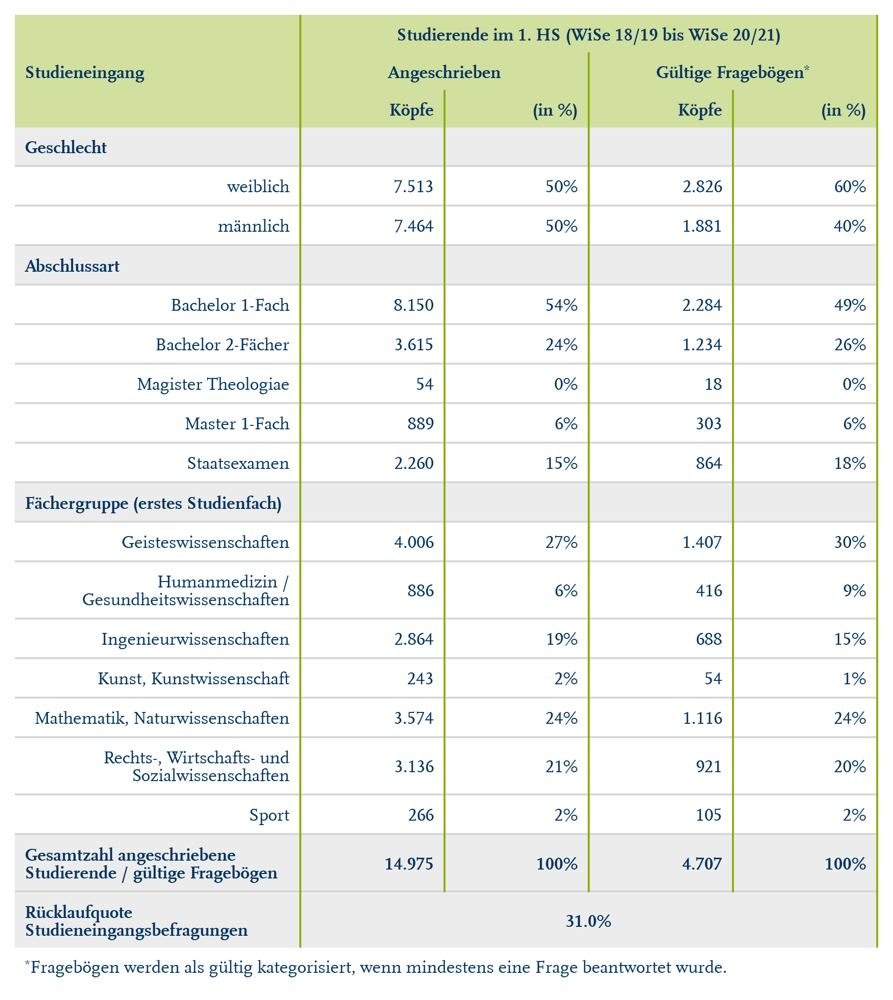

# Get formatted flextable of response rates for the Eingangsbefragung

Get formatted flextable of response rates for the Eingangsbefragung

## Usage

``` r
rub_table_eb(df, typology, headings, padding = 3L)
```

## Arguments

- df:

  Data frame

- typology:

  Data frame with flextable typology

- headings:

  Character vectors of headings

- padding:

  Integer, padding in pts (points) passed to
  [`flextable::padding()`](https://davidgohel.github.io/flextable/reference/padding.html)

## Value

Formatted Flextable

## Illustrations



## Examples

``` r
# Generate example data
df_example <- data.frame(
  stringsAsFactors = FALSE,
  studieneingang = c(
    "Geschlecht","weiblich",
    "m\u00E4nnlich","Abschlussart","Bachelor 1-Fach",
    "Bachelor 2-F\u00E4cher","Staatsexamen","Magister Theologiae",
    "Master 1-Fach","Master 2-F\u00E4cher","Master of Education",
    "F\u00E4chergruppe (erstes Studienfach)","Geisteswissenschaften",
    "Humanmedizin / Gesundheitswissenschaften",
    "Ingenieurwissenschaften","Kunst, Kunstwissenschaft",
    "Mathematik, Naturwissenschaften",
    "Rechts-, Wirtschafts-, Sozialwissenschaften","Sport",
    "Gesamtzahl angeschriebene Studierende / g\u00FCltige Frageb\u00F6gen",
    "R\u00FCcklaufquote Studieneingangsbefragungen"
  ),
  koepfe_rub = c(
    NA,"7.403","7.416",NA,
    "8.006","3.607","2.259","54","886","7",NA,NA,"3.364",
    "852","3.782","242","2.647","3.668","264","14.819",
    "31%"
  ),
  koepfe_rub_perc = c(
    NA,"50%","50%",NA,"54%",
    "24%","15%","0,4%","6,0%","<0,1%",NA,NA,"23%",
    "5,7%","26%","1,6%","18%","25%","1,8%","100%","31%"
  ),
  koepfe_bef = c(
    NA,"2.769","1.865",NA,
    "2.213","1.232","864","18","303","4",NA,NA,"1.094",
    "397","941","54","868","1.176","104","4.634","31%"
  ),
  koepfe_bef_perc = c(
    NA,"60%","40%",NA,"48%",
    "27%","19%","0,4%","6,5%","<0,1%",NA,NA,"24%",
    "8,6%","20%","1,2%","19%","25%","2,2%","100%","31%"
  ),
  row_id = c(
    1L,2L,3L,4L,5L,6L,7L,8L,
    9L,10L,11L,12L,13L,14L,15L,16L,17L,18L,19L,
    20L,21L
    )
)

# Multi-level headings, see `flextable::set_headers`
typology_example <- structure(
  list(
    col_keys = c(
      "studieneingang", "koepfe_rub", "koepfe_rub_perc", "koepfe_bef", "koepfe_bef_perc"
    ),
    colC = c(
      "Studieneingang", "Studierende im 1. HS (WiSe 18/19 bis  WiSe 20/21)",
      "Studierende im 1. HS (WiSe 18/19 bis  WiSe 20/21)",
      "Studierende im 1. HS (WiSe 18/19 bis  WiSe 20/21)",
      "Studierende im 1. HS (WiSe 18/19 bis  WiSe 20/21)"
    ),
    colB = c(
      "Studieneingang", "Angeschrieben", "Angeschrieben", "G\u00FCltige Frageb\u00F6gen",
      "G\u00FCltige Frageb\u00F6gen"
    ),
    colA = c(
      "Studieneingang", "K\u00F6pfe", "(in %)", "K\u00F6pfe", "(in %)"
    )
  ),
  class = c("data.frame"),
  row.names = c(NA, -5L)
)

# Text for rows that receive special formatting
headings_example <- c(
  "Geschlecht", "Abschlussart", "F\u00E4chergruppe (erstes Studienfach)",
  "Gesamtzahl angeschriebene Studierende / g\u00FCltige Frageb\u00F6gen",
  "R\u00FCcklaufquote Studieneingangsbefragungen"
)

# Function call
rub_table_eb(
  df = df_example,
  typology = typology_example,
  headings = headings_example
)


.cl-a36e5b12{}.cl-a36643d2{font-family:'RUB Scala TZ';font-size:9pt;font-weight:bold;font-style:normal;text-decoration:none;color:rgba(0, 53, 96, 1.00);background-color:transparent;}.cl-a36643e6{font-family:'RUB Scala TZ';font-size:5.4pt;font-weight:bold;font-style:normal;text-decoration:none;color:rgba(0, 53, 96, 1.00);background-color:transparent;vertical-align:super;}.cl-a36643e7{font-family:'RUB Scala TZ';font-size:9pt;font-weight:normal;font-style:normal;text-decoration:none;color:rgba(0, 53, 96, 1.00);background-color:transparent;}.cl-a36643f0{font-family:'RUB Scala TZ';font-size:5.4pt;font-weight:normal;font-style:normal;text-decoration:none;color:rgba(0, 53, 96, 1.00);background-color:transparent;vertical-align:super;}.cl-a36a58be{margin:0;text-align:left;border-bottom: 0 solid rgba(0, 0, 0, 1.00);border-top: 0 solid rgba(0, 0, 0, 1.00);border-left: 0 solid rgba(0, 0, 0, 1.00);border-right: 0 solid rgba(0, 0, 0, 1.00);padding-bottom:5pt;padding-top:5pt;padding-left:5pt;padding-right:5pt;line-height: 1;background-color:transparent;}.cl-a36a58c8{margin:0;text-align:center;border-bottom: 0 solid rgba(0, 0, 0, 1.00);border-top: 0 solid rgba(0, 0, 0, 1.00);border-left: 0 solid rgba(0, 0, 0, 1.00);border-right: 0 solid rgba(0, 0, 0, 1.00);padding-bottom:5pt;padding-top:5pt;padding-left:5pt;padding-right:5pt;line-height: 1;background-color:transparent;}.cl-a36a58d2{margin:0;text-align:right;border-bottom: 0 solid rgba(0, 0, 0, 1.00);border-top: 0 solid rgba(0, 0, 0, 1.00);border-left: 0 solid rgba(0, 0, 0, 1.00);border-right: 0 solid rgba(0, 0, 0, 1.00);padding-bottom:5pt;padding-top:5pt;padding-left:5pt;padding-right:5pt;line-height: 1;background-color:transparent;}.cl-a36a58d3{margin:0;text-align:left;border-bottom: 0 solid rgba(0, 0, 0, 1.00);border-top: 0 solid rgba(0, 0, 0, 1.00);border-left: 0 solid rgba(0, 0, 0, 1.00);border-right: 0 solid rgba(0, 0, 0, 1.00);padding-bottom:3pt;padding-top:3pt;padding-left:3pt;padding-right:3pt;line-height: 1;background-color:transparent;}.cl-a36a58dc{margin:0;text-align:right;border-bottom: 0 solid rgba(0, 0, 0, 1.00);border-top: 0 solid rgba(0, 0, 0, 1.00);border-left: 0 solid rgba(0, 0, 0, 1.00);border-right: 0 solid rgba(0, 0, 0, 1.00);padding-bottom:3pt;padding-top:3pt;padding-left:3pt;padding-right:3pt;line-height: 1;background-color:transparent;}.cl-a36a58dd{margin:0;text-align:center;border-bottom: 0 solid rgba(0, 0, 0, 1.00);border-top: 0 solid rgba(0, 0, 0, 1.00);border-left: 0 solid rgba(0, 0, 0, 1.00);border-right: 0 solid rgba(0, 0, 0, 1.00);padding-bottom:3pt;padding-top:3pt;padding-left:3pt;padding-right:3pt;line-height: 1;background-color:transparent;}.cl-a36a58de{margin:0;text-align:left;border-bottom: 0 solid rgba(0, 0, 0, 1.00);border-top: 0 solid rgba(0, 0, 0, 1.00);border-left: 0 solid rgba(0, 0, 0, 1.00);border-right: 0 solid rgba(0, 0, 0, 1.00);padding-bottom:5pt;padding-top:5pt;padding-left:5pt;padding-right:5pt;line-height: 1;background-color:transparent;}.cl-a36a7bf0{width:2in;background-color:rgba(209, 223, 159, 1.00);vertical-align: top;border-bottom: 0 solid rgba(0, 0, 0, 1.00);border-top: 0 solid rgba(0, 0, 0, 1.00);border-left: 0 solid rgba(0, 0, 0, 1.00);border-right: 1pt solid rgba(141, 174, 16, 1.00);margin-bottom:0;margin-top:0;margin-left:0;margin-right:0;}.cl-a36a7bfa{width:1in;background-color:rgba(209, 223, 159, 1.00);vertical-align: top;border-bottom: 0 solid rgba(0, 0, 0, 1.00);border-top: 0 solid rgba(0, 0, 0, 1.00);border-left: 1pt solid rgba(141, 174, 16, 1.00);border-right: 1pt solid rgba(141, 174, 16, 1.00);margin-bottom:0;margin-top:0;margin-left:0;margin-right:0;}.cl-a36a7bfb{width:1in;background-color:rgba(209, 223, 159, 1.00);vertical-align: top;border-bottom: 0 solid rgba(0, 0, 0, 1.00);border-top: 0 solid rgba(0, 0, 0, 1.00);border-left: 1pt solid rgba(141, 174, 16, 1.00);border-right: 1pt solid rgba(141, 174, 16, 1.00);margin-bottom:0;margin-top:0;margin-left:0;margin-right:0;}.cl-a36a7bfc{width:2in;background-color:rgba(236, 236, 236, 1.00);vertical-align: middle;border-bottom: 1pt solid rgba(215, 215, 215, 1.00);border-top: 0 solid rgba(0, 0, 0, 1.00);border-left: 0 solid rgba(0, 0, 0, 1.00);border-right: 1pt solid rgba(141, 174, 16, 1.00);margin-bottom:0;margin-top:0;margin-left:0;margin-right:0;}.cl-a36a7c04{width:1in;background-color:rgba(236, 236, 236, 1.00);vertical-align: middle;border-bottom: 1pt solid rgba(215, 215, 215, 1.00);border-top: 0 solid rgba(0, 0, 0, 1.00);border-left: 1pt solid rgba(141, 174, 16, 1.00);border-right: 1pt solid rgba(141, 174, 16, 1.00);margin-bottom:0;margin-top:0;margin-left:0;margin-right:0;}.cl-a36a7c05{width:2in;background-color:transparent;vertical-align: middle;border-bottom: 1pt solid rgba(215, 215, 215, 1.00);border-top: 1pt solid rgba(215, 215, 215, 1.00);border-left: 0 solid rgba(0, 0, 0, 1.00);border-right: 1pt solid rgba(141, 174, 16, 1.00);margin-bottom:0;margin-top:0;margin-left:0;margin-right:0;}.cl-a36a7c0e{width:1in;background-color:transparent;vertical-align: middle;border-bottom: 1pt solid rgba(215, 215, 215, 1.00);border-top: 1pt solid rgba(215, 215, 215, 1.00);border-left: 1pt solid rgba(141, 174, 16, 1.00);border-right: 1pt solid rgba(141, 174, 16, 1.00);margin-bottom:0;margin-top:0;margin-left:0;margin-right:0;}.cl-a36a7c0f{width:2in;background-color:rgba(236, 236, 236, 1.00);vertical-align: middle;border-bottom: 1pt solid rgba(215, 215, 215, 1.00);border-top: 1pt solid rgba(215, 215, 215, 1.00);border-left: 0 solid rgba(0, 0, 0, 1.00);border-right: 1pt solid rgba(141, 174, 16, 1.00);margin-bottom:0;margin-top:0;margin-left:0;margin-right:0;}.cl-a36a7c10{width:1in;background-color:rgba(236, 236, 236, 1.00);vertical-align: middle;border-bottom: 1pt solid rgba(215, 215, 215, 1.00);border-top: 1pt solid rgba(215, 215, 215, 1.00);border-left: 1pt solid rgba(141, 174, 16, 1.00);border-right: 1pt solid rgba(141, 174, 16, 1.00);margin-bottom:0;margin-top:0;margin-left:0;margin-right:0;}.cl-a36a7c18{width:2in;background-color:rgba(236, 236, 236, 1.00);vertical-align: middle;border-bottom: 0 solid rgba(0, 0, 0, 1.00);border-top: 1pt solid rgba(215, 215, 215, 1.00);border-left: 0 solid rgba(0, 0, 0, 1.00);border-right: 1pt solid rgba(141, 174, 16, 1.00);margin-bottom:0;margin-top:0;margin-left:0;margin-right:0;}.cl-a36a7c19{width:1in;background-color:rgba(236, 236, 236, 1.00);vertical-align: middle;border-bottom: 0 solid rgba(0, 0, 0, 1.00);border-top: 1pt solid rgba(215, 215, 215, 1.00);border-left: 1pt solid rgba(141, 174, 16, 1.00);border-right: 1pt solid rgba(141, 174, 16, 1.00);margin-bottom:0;margin-top:0;margin-left:0;margin-right:0;}.cl-a36a7c1a{width:2in;background-color:transparent;vertical-align: middle;border-bottom: 0 solid rgba(0, 0, 0, 1.00);border-top: 0 solid rgba(0, 0, 0, 1.00);border-left: 0 solid rgba(0, 0, 0, 1.00);border-right: 0 solid rgba(0, 0, 0, 1.00);margin-bottom:0;margin-top:0;margin-left:0;margin-right:0;}.cl-a36a7c22{width:1in;background-color:transparent;vertical-align: middle;border-bottom: 0 solid rgba(0, 0, 0, 1.00);border-top: 0 solid rgba(0, 0, 0, 1.00);border-left: 0 solid rgba(0, 0, 0, 1.00);border-right: 0 solid rgba(0, 0, 0, 1.00);margin-bottom:0;margin-top:0;margin-left:0;margin-right:0;}


Studieneingang
```
