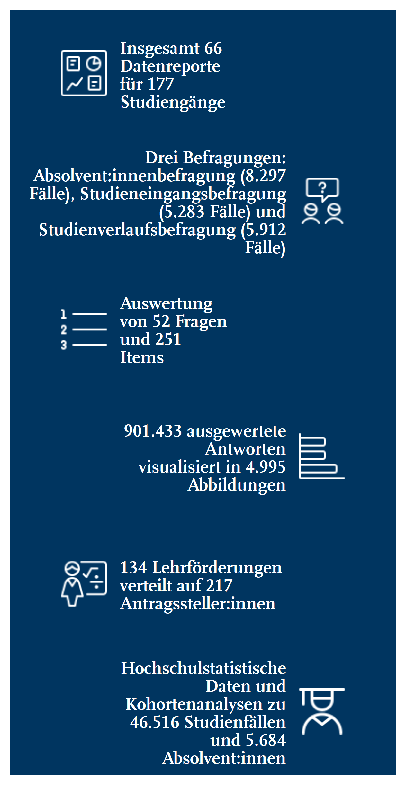

# Get formatted flextable of metrics

Get formatted flextable of metrics

## Usage

``` r
rub_table_metrics(df)
```

## Arguments

- df:

  Data frame

## Value

Formatted flextable

## Illustrations



## Examples

``` r
# Path to skeleton files
path_skeleton <- fs::path_package(
  package = "RUBer",
  "rmarkdown",
  "templates",
  "datenreport-2022",
  "skeleton"
)

# Read csv file
df_metrics <- read.csv(
  fs::path(
    path_skeleton,
    "metrics_overview.csv"
  ),
  encoding = "UTF-8"
)

# Extract vectors from data frame, construct full file paths
metrics_text <- df_metrics[["metrics_text"]]
metrics_images <- as.character(
  fs::path(
    path_skeleton,
    df_metrics[["metrics_images"]]
  )
)

# For presentation purposes, the data is split into six columns
df_metrics_table <- tibble::tribble(
  ~col1, ~col2, ~col3, ~col4, ~col5, ~col6,
  metrics_images[1], metrics_text[1], metrics_text[1],
  metrics_text[1], NA_character_, NA_character_,
  metrics_text[2], metrics_text[2], metrics_text[2],
  metrics_text[2], metrics_text[2], metrics_images[2],
  metrics_images[3], metrics_text[3], metrics_text[3],
  metrics_text[3], NA_character_, NA_character_,
  NA_character_, NA_character_, metrics_text[4],
  metrics_text[4], metrics_text[4], metrics_images[4],
  metrics_images[5], metrics_text[5], metrics_text[5],
  metrics_text[5], metrics_text[5], NA_character_,
  NA_character_, metrics_text[6], metrics_text[6],
  metrics_text[6], metrics_text[6], metrics_images[6]
)

# Function call
rub_table_metrics(
  df_metrics_table
)


.cl-a421ab86{}.cl-a41a6010{font-family:'RUB Scala TZ';font-size:14pt;font-weight:bold;font-style:normal;text-decoration:none;color:rgba(255, 255, 255, 1.00);background-color:transparent;}.cl-a41d0b80{margin:0;text-align:right;border-bottom: 0 solid rgba(0, 0, 0, 1.00);border-top: 0 solid rgba(0, 0, 0, 1.00);border-left: 0 solid rgba(0, 0, 0, 1.00);border-right: 0 solid rgba(0, 0, 0, 1.00);padding-bottom:5pt;padding-top:5pt;padding-left:5pt;padding-right:5pt;line-height: 1;background-color:transparent;}.cl-a41d0b8a{margin:0;text-align:left;border-bottom: 0 solid rgba(0, 0, 0, 1.00);border-top: 0 solid rgba(0, 0, 0, 1.00);border-left: 0 solid rgba(0, 0, 0, 1.00);border-right: 0 solid rgba(0, 0, 0, 1.00);padding-bottom:5pt;padding-top:5pt;padding-left:5pt;padding-right:5pt;line-height: 1;background-color:transparent;}.cl-a41d2c00{width:1.122in;height:1.378in;background-color:rgba(0, 53, 96, 1.00);vertical-align: middle;border-bottom: 0 solid rgba(0, 0, 0, 1.00);border-top: 0 solid rgba(0, 0, 0, 1.00);border-left: 0 solid rgba(0, 0, 0, 1.00);border-right: 0 solid rgba(0, 0, 0, 1.00);margin-bottom:0;margin-top:0;margin-left:0;margin-right:0;}.cl-a41d2c0a{width:1.122in;height:1.378in;background-color:rgba(0, 53, 96, 1.00);vertical-align: middle;border-bottom: 0 solid rgba(0, 0, 0, 1.00);border-top: 0 solid rgba(0, 0, 0, 1.00);border-left: 0 solid rgba(0, 0, 0, 1.00);border-right: 0 solid rgba(0, 0, 0, 1.00);margin-bottom:0;margin-top:0;margin-left:0;margin-right:0;}

```
