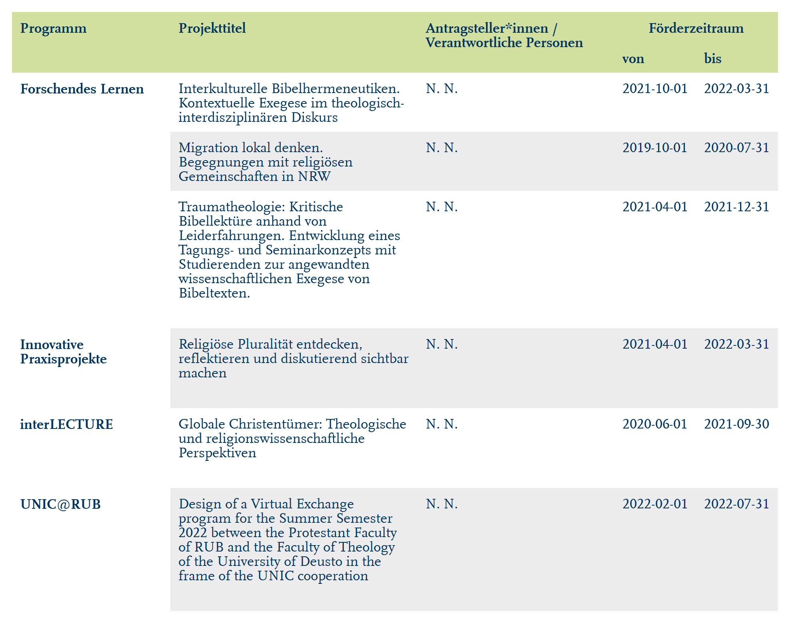

# Get formatted flextable of funded projects

Get formatted flextable of funded projects

## Usage

``` r
rub_table_programs(df)
```

## Arguments

- df:

  Data frame

## Value

Formatted Flextable

## Illustrations



## Examples

``` r
# Create example data
example_data <- data.frame(
  stringsAsFactors = FALSE,
  report_nr = c(
    1,
    1,
    1,
    1,
    1,
    1
  ),
  programm = c(
    "Forschendes Lernen",
    "Forschendes Lernen",
    "Forschendes Lernen",
    "Innovative Praxisprojekte",
    "interLECTURE",
    "UNIC@RUB"
  ),
  projekttitel = c(
    "Interkulturelle Bibelhermeneutiken",
    "Migration lokal denken. Begegnungen mit religi\u00F6sen Gemeinschaften in NRW",
    "Traumatheologie: Kritische Bibellekt\u00FCre anhand von Leiderfahrungen.",
    "Religi\u00F6se Pluralit\u00E4t entdecken, reflektieren und diskutierend sichtbar machen",
    "Globale Christent\u00FCmer: Theologische und religionswissenschaftliche Perspektiven",
    "Design of a Virtual Exchange program"
  ),
  antragsteller_innen_verantwortliche_personen = c(
    "N. N.",
    "N. N.",
    "N. N.",
    "N. N.",
    "N. N.",
    "N. N."
  ),
  forderzeitraum_von = c(
    "2021-10-01",
    "2019-10-01",
    "2021-04-01",
    "2021-04-01",
    "2020-06-01",
    "2022-02-01"
  ),
  forderzeitraum_bis = c(
    "2022-03-31",
    "2020-07-31",
    "2021-12-31",
    "2022-03-31",
    "2021-09-30",
    "2022-07-31"
  ),
  is_last_row = c(
    FALSE,
    FALSE,
    TRUE,
    TRUE,
    TRUE,
    TRUE
  )
)

# Function call
rub_table_programs(
  df = example_data
)


.cl-c3db5bf4{}.cl-c3d402f0{font-family:'RUB Scala TZ';font-size:9pt;font-weight:bold;font-style:normal;text-decoration:none;color:rgba(0, 53, 96, 1.00);background-color:transparent;}.cl-c3d402fa{font-family:'RUB Scala TZ';font-size:9pt;font-weight:normal;font-style:normal;text-decoration:none;color:rgba(0, 53, 96, 1.00);background-color:transparent;}.cl-c3d7269c{margin:0;text-align:left;border-bottom: 0 solid rgba(0, 0, 0, 1.00);border-top: 0 solid rgba(0, 0, 0, 1.00);border-left: 0 solid rgba(0, 0, 0, 1.00);border-right: 0 solid rgba(0, 0, 0, 1.00);padding-bottom:5pt;padding-top:5pt;padding-left:5pt;padding-right:5pt;line-height: 1;background-color:transparent;}.cl-c3d726a6{margin:0;text-align:center;border-bottom: 0 solid rgba(0, 0, 0, 1.00);border-top: 0 solid rgba(0, 0, 0, 1.00);border-left: 0 solid rgba(0, 0, 0, 1.00);border-right: 0 solid rgba(0, 0, 0, 1.00);padding-bottom:5pt;padding-top:5pt;padding-left:5pt;padding-right:5pt;line-height: 1;background-color:transparent;}.cl-c3d726b0{margin:0;text-align:left;border-bottom: 0 solid rgba(0, 0, 0, 1.00);border-top: 0 solid rgba(0, 0, 0, 1.00);border-left: 0 solid rgba(0, 0, 0, 1.00);border-right: 0 solid rgba(0, 0, 0, 1.00);padding-bottom:18pt;padding-top:5pt;padding-left:5pt;padding-right:5pt;line-height: 1;background-color:transparent;}.cl-c3d74dca{width:1.378in;background-color:rgba(209, 223, 159, 1.00);vertical-align: top;border-bottom: 0 solid rgba(0, 0, 0, 1.00);border-top: 0 solid rgba(0, 0, 0, 1.00);border-left: 0 solid rgba(0, 0, 0, 1.00);border-right: 0 solid rgba(0, 0, 0, 1.00);margin-bottom:0;margin-top:0;margin-left:0;margin-right:0;}.cl-c3d74dde{width:2.146in;background-color:rgba(209, 223, 159, 1.00);vertical-align: top;border-bottom: 0 solid rgba(0, 0, 0, 1.00);border-top: 0 solid rgba(0, 0, 0, 1.00);border-left: 0 solid rgba(0, 0, 0, 1.00);border-right: 0 solid rgba(0, 0, 0, 1.00);margin-bottom:0;margin-top:0;margin-left:0;margin-right:0;}.cl-c3d74ddf{width:1.709in;background-color:rgba(209, 223, 159, 1.00);vertical-align: top;border-bottom: 0 solid rgba(0, 0, 0, 1.00);border-top: 0 solid rgba(0, 0, 0, 1.00);border-left: 0 solid rgba(0, 0, 0, 1.00);border-right: 0 solid rgba(0, 0, 0, 1.00);margin-bottom:0;margin-top:0;margin-left:0;margin-right:0;}.cl-c3d74de8{width:0.709in;background-color:rgba(209, 223, 159, 1.00);vertical-align: top;border-bottom: 0 solid rgba(0, 0, 0, 1.00);border-top: 0 solid rgba(0, 0, 0, 1.00);border-left: 0 solid rgba(0, 0, 0, 1.00);border-right: 0 solid rgba(0, 0, 0, 1.00);margin-bottom:0;margin-top:0;margin-left:0;margin-right:0;}.cl-c3d74de9{width:0.709in;background-color:rgba(209, 223, 159, 1.00);vertical-align: top;border-bottom: 0 solid rgba(0, 0, 0, 1.00);border-top: 0 solid rgba(0, 0, 0, 1.00);border-left: 0 solid rgba(0, 0, 0, 1.00);border-right: 0 solid rgba(0, 0, 0, 1.00);margin-bottom:0;margin-top:0;margin-left:0;margin-right:0;}.cl-c3d74df2{width:1.378in;background-color:transparent;vertical-align: top;border-bottom: 0 solid rgba(0, 0, 0, 1.00);border-top: 0 solid rgba(0, 0, 0, 1.00);border-left: 0 solid rgba(0, 0, 0, 1.00);border-right: 0 solid rgba(0, 0, 0, 1.00);margin-bottom:0;margin-top:0;margin-left:0;margin-right:0;}.cl-c3d74dfc{width:2.146in;background-color:transparent;vertical-align: top;border-bottom: 0 solid rgba(0, 0, 0, 1.00);border-top: 0 solid rgba(0, 0, 0, 1.00);border-left: 0 solid rgba(0, 0, 0, 1.00);border-right: 0 solid rgba(0, 0, 0, 1.00);margin-bottom:0;margin-top:0;margin-left:0;margin-right:0;}.cl-c3d74dfd{width:1.709in;background-color:transparent;vertical-align: top;border-bottom: 0 solid rgba(0, 0, 0, 1.00);border-top: 0 solid rgba(0, 0, 0, 1.00);border-left: 0 solid rgba(0, 0, 0, 1.00);border-right: 0 solid rgba(0, 0, 0, 1.00);margin-bottom:0;margin-top:0;margin-left:0;margin-right:0;}.cl-c3d74e06{width:0.709in;background-color:transparent;vertical-align: top;border-bottom: 0 solid rgba(0, 0, 0, 1.00);border-top: 0 solid rgba(0, 0, 0, 1.00);border-left: 0 solid rgba(0, 0, 0, 1.00);border-right: 0 solid rgba(0, 0, 0, 1.00);margin-bottom:0;margin-top:0;margin-left:0;margin-right:0;}.cl-c3d74e10{width:2.146in;background-color:rgba(236, 236, 236, 1.00);vertical-align: top;border-bottom: 0 solid rgba(0, 0, 0, 1.00);border-top: 0 solid rgba(0, 0, 0, 1.00);border-left: 0 solid rgba(0, 0, 0, 1.00);border-right: 0 solid rgba(0, 0, 0, 1.00);margin-bottom:0;margin-top:0;margin-left:0;margin-right:0;}.cl-c3d74e1a{width:1.709in;background-color:rgba(236, 236, 236, 1.00);vertical-align: top;border-bottom: 0 solid rgba(0, 0, 0, 1.00);border-top: 0 solid rgba(0, 0, 0, 1.00);border-left: 0 solid rgba(0, 0, 0, 1.00);border-right: 0 solid rgba(0, 0, 0, 1.00);margin-bottom:0;margin-top:0;margin-left:0;margin-right:0;}.cl-c3d74e1b{width:0.709in;background-color:rgba(236, 236, 236, 1.00);vertical-align: top;border-bottom: 0 solid rgba(0, 0, 0, 1.00);border-top: 0 solid rgba(0, 0, 0, 1.00);border-left: 0 solid rgba(0, 0, 0, 1.00);border-right: 0 solid rgba(0, 0, 0, 1.00);margin-bottom:0;margin-top:0;margin-left:0;margin-right:0;}


Programm
```
