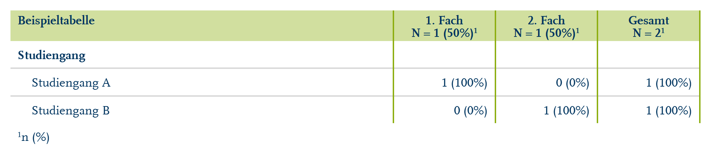

# Get formatted flextable of student cases

Get formatted flextable of student cases

## Usage

``` r
rub_table_stg(df, label)
```

## Arguments

- df:

  Data frame with columns `studiengang`, `studienfachzaehler`, `faelle`

- label:

  Label for the first column

## Value

Formatted Flextable

## Illustrations



## Examples

``` r
rub_table_stg(
  df = tibble::tribble(
    ~studiengang, ~studienfachzaehler, ~faelle,
    "Studiengang A", "1. Fach", 1,
    "Studiengang B", "2. Fach", 1
  ),
  label = "Beispieltabelle"
)


.cl-a4f4cd90{}.cl-a4ed5380{font-family:'RUB Scala TZ';font-size:9pt;font-weight:bold;font-style:normal;text-decoration:none;color:rgba(0, 53, 96, 1.00);background-color:transparent;}.cl-a4ed5394{font-family:'RUB Scala TZ';font-size:5.4pt;font-weight:bold;font-style:normal;text-decoration:none;color:rgba(0, 53, 96, 1.00);background-color:transparent;vertical-align:super;}.cl-a4ed539e{font-family:'RUB Scala TZ';font-size:9pt;font-weight:normal;font-style:normal;text-decoration:none;color:rgba(0, 53, 96, 1.00);background-color:transparent;}.cl-a4ed539f{font-family:'RUB Scala TZ';font-size:5.4pt;font-weight:normal;font-style:normal;text-decoration:none;color:rgba(0, 53, 96, 1.00);background-color:transparent;vertical-align:super;}.cl-a4effa72{margin:0;text-align:left;border-bottom: 0 solid rgba(0, 0, 0, 1.00);border-top: 0 solid rgba(0, 0, 0, 1.00);border-left: 0 solid rgba(0, 0, 0, 1.00);border-right: 0 solid rgba(0, 0, 0, 1.00);padding-bottom:2pt;padding-top:2pt;padding-left:5pt;padding-right:5pt;line-height: 1;background-color:transparent;}.cl-a4effa7c{margin:0;text-align:center;border-bottom: 0 solid rgba(0, 0, 0, 1.00);border-top: 0 solid rgba(0, 0, 0, 1.00);border-left: 0 solid rgba(0, 0, 0, 1.00);border-right: 0 solid rgba(0, 0, 0, 1.00);padding-bottom:2pt;padding-top:2pt;padding-left:5pt;padding-right:5pt;line-height: 1;background-color:transparent;}.cl-a4effa7d{margin:0;text-align:left;border-bottom: 0 solid rgba(0, 0, 0, 1.00);border-top: 0 solid rgba(0, 0, 0, 1.00);border-left: 0 solid rgba(0, 0, 0, 1.00);border-right: 0 solid rgba(0, 0, 0, 1.00);padding-bottom:5pt;padding-top:5pt;padding-left:5pt;padding-right:5pt;line-height: 1;background-color:transparent;}.cl-a4effa86{margin:0;text-align:left;border-bottom: 0 solid rgba(0, 0, 0, 1.00);border-top: 0 solid rgba(0, 0, 0, 1.00);border-left: 0 solid rgba(0, 0, 0, 1.00);border-right: 0 solid rgba(0, 0, 0, 1.00);padding-bottom:5pt;padding-top:5pt;padding-left:15pt;padding-right:5pt;line-height: 1;background-color:transparent;}.cl-a4effa87{margin:0;text-align:right;border-bottom: 0 solid rgba(0, 0, 0, 1.00);border-top: 0 solid rgba(0, 0, 0, 1.00);border-left: 0 solid rgba(0, 0, 0, 1.00);border-right: 0 solid rgba(0, 0, 0, 1.00);padding-bottom:5pt;padding-top:5pt;padding-left:5pt;padding-right:5pt;line-height: 1;background-color:transparent;}.cl-a4effa90{margin:0;text-align:left;border-bottom: 0 solid rgba(0, 0, 0, 1.00);border-top: 0 solid rgba(0, 0, 0, 1.00);border-left: 0 solid rgba(0, 0, 0, 1.00);border-right: 0 solid rgba(0, 0, 0, 1.00);padding-bottom:5pt;padding-top:5pt;padding-left:5pt;padding-right:5pt;line-height: 1;background-color:transparent;}.cl-a4f01d54{width:3.8in;background-color:rgba(209, 223, 159, 1.00);vertical-align: top;border-bottom: 0 solid rgba(0, 0, 0, 1.00);border-top: 0 solid rgba(0, 0, 0, 1.00);border-left: 0 solid rgba(0, 0, 0, 1.00);border-right: 1pt solid rgba(141, 174, 16, 1.00);margin-bottom:0;margin-top:0;margin-left:0;margin-right:0;}.cl-a4f01d5e{width:1in;background-color:rgba(209, 223, 159, 1.00);vertical-align: top;border-bottom: 0 solid rgba(0, 0, 0, 1.00);border-top: 0 solid rgba(0, 0, 0, 1.00);border-left: 1pt solid rgba(141, 174, 16, 1.00);border-right: 1pt solid rgba(141, 174, 16, 1.00);margin-bottom:0;margin-top:0;margin-left:0;margin-right:0;}.cl-a4f01d5f{width:3.8in;background-color:transparent;vertical-align: top;border-bottom: 1pt solid rgba(215, 215, 215, 1.00);border-top: 0 solid rgba(0, 0, 0, 1.00);border-left: 0 solid rgba(0, 0, 0, 1.00);border-right: 1pt solid rgba(141, 174, 16, 1.00);margin-bottom:0;margin-top:0;margin-left:0;margin-right:0;}.cl-a4f01d60{width:1in;background-color:transparent;vertical-align: top;border-bottom: 1pt solid rgba(215, 215, 215, 1.00);border-top: 0 solid rgba(0, 0, 0, 1.00);border-left: 1pt solid rgba(141, 174, 16, 1.00);border-right: 1pt solid rgba(141, 174, 16, 1.00);margin-bottom:0;margin-top:0;margin-left:0;margin-right:0;}.cl-a4f01d68{width:3.8in;background-color:transparent;vertical-align: top;border-bottom: 1pt solid rgba(215, 215, 215, 1.00);border-top: 1pt solid rgba(215, 215, 215, 1.00);border-left: 0 solid rgba(0, 0, 0, 1.00);border-right: 1pt solid rgba(141, 174, 16, 1.00);margin-bottom:0;margin-top:0;margin-left:0;margin-right:0;}.cl-a4f01d69{width:1in;background-color:transparent;vertical-align: top;border-bottom: 1pt solid rgba(215, 215, 215, 1.00);border-top: 1pt solid rgba(215, 215, 215, 1.00);border-left: 1pt solid rgba(141, 174, 16, 1.00);border-right: 1pt solid rgba(141, 174, 16, 1.00);margin-bottom:0;margin-top:0;margin-left:0;margin-right:0;}.cl-a4f01d72{width:3.8in;background-color:transparent;vertical-align: top;border-bottom: 0 solid rgba(0, 0, 0, 1.00);border-top: 1pt solid rgba(215, 215, 215, 1.00);border-left: 0 solid rgba(0, 0, 0, 1.00);border-right: 1pt solid rgba(141, 174, 16, 1.00);margin-bottom:0;margin-top:0;margin-left:0;margin-right:0;}.cl-a4f01d73{width:1in;background-color:transparent;vertical-align: top;border-bottom: 0 solid rgba(0, 0, 0, 1.00);border-top: 1pt solid rgba(215, 215, 215, 1.00);border-left: 1pt solid rgba(141, 174, 16, 1.00);border-right: 1pt solid rgba(141, 174, 16, 1.00);margin-bottom:0;margin-top:0;margin-left:0;margin-right:0;}.cl-a4f01d7c{width:3.8in;background-color:transparent;vertical-align: middle;border-bottom: 0 solid rgba(0, 0, 0, 1.00);border-top: 0 solid rgba(0, 0, 0, 1.00);border-left: 0 solid rgba(0, 0, 0, 1.00);border-right: 0 solid rgba(0, 0, 0, 1.00);margin-bottom:0;margin-top:0;margin-left:0;margin-right:0;}.cl-a4f01d7d{width:1in;background-color:transparent;vertical-align: middle;border-bottom: 0 solid rgba(0, 0, 0, 1.00);border-top: 0 solid rgba(0, 0, 0, 1.00);border-left: 0 solid rgba(0, 0, 0, 1.00);border-right: 0 solid rgba(0, 0, 0, 1.00);margin-bottom:0;margin-top:0;margin-left:0;margin-right:0;}


Beispieltabelle
```
