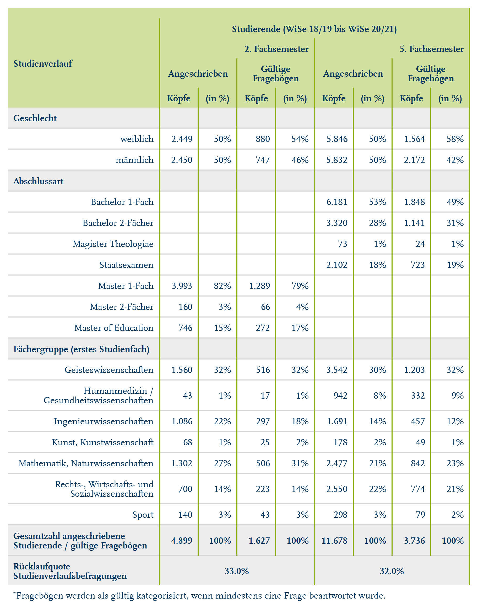

# Get formatted flextable of response rates for the Verlaufsbefragung

Get formatted flextable of response rates for the Verlaufsbefragung

## Usage

``` r
rub_table_vb(df, typology, headings, padding = 3L)
```

## Arguments

- df:

  Data frame

- typology:

  Data frame with flextable typology

- headings:

  Character vectors of headings

- padding:

  Integer, padding in pts (points) passed to
  [`flextable::padding()`](https://davidgohel.github.io/flextable/reference/padding.html)

## Value

Formatted Flextable

## Illustrations



## Examples

``` r
# Create example data
studienverlauf <- data.frame(
  stringsAsFactors = FALSE,
  studienverlauf = c("Geschlecht","weiblich",
                     "m\u00E4nnlich","Abschlussart","Bachelor 1-Fach",
                     "Bachelor 2-F\u00E4cher","Staatsexamen","Magister Theologiae",
                     "Master 1-Fach","Master 2-F\u00E4cher",
                     "Master of Education","F\u00E4chergruppe (erstes Studienfach)",
                     "Geisteswissenschaften",
                     "Humanmedizin / Gesundheitswissenschaften","Ingenieurwissenschaften",
                     "Kunst, Kunstwissenschaft","Mathematik, Naturwissenschaften",
                     "Rechts-, Wirtschafts-, Sozialwissenschaften","Sport",
                     "Gesamtzahl angeschriebene Studierende / g\u00FCltige Frageb\u00F6gen",
                     "R\u00FCcklaufquote Studienverlaufsbefragungen"),
  koepfe_2fs_rub = c(NA,"1.597","1.576",NA,
                     NA,NA,NA,NA,"2.590","99","484",NA,"733",NA,
                     "776","40","718","805","101","3.173","38%"),
  koepfe_2fs_rub_perc = c(NA,"50%","50%",NA,NA,
                          NA,NA,NA,"82%","3,1%","15%",NA,"23%",NA,
                          "24%","1,3%","23%","25%","3,2%","100%","38%"),
  koepfe_2fs_bef = c(NA,"652","561",NA,NA,
                     NA,NA,NA,"964","49","200",NA,"278",NA,"281",
                     "18","320","278","38","1.213","38%"),
  koepfe_2fs_bef_perc = c(NA,"54%","46%",NA,NA,
                          NA,NA,NA,"79%","4,0%","16%",NA,"23%",NA,
                          "23%","1,5%","26%","23%","3,1%","100%","38%"),
  koepfe_5fs_rub = c(NA,"5.720","5.785",NA,
                     "6.010","3.320","2.102","73",NA,NA,NA,NA,
                     "2.942","942","2.256","178","1.912","2.977","298",
                     "11.505","32%"),
  koepfe_5fs_rub_perc = c(NA,"50%","50%",NA,
                          "52%","29%","18%","0,6%",NA,NA,NA,NA,"26%",
                          "8,2%","20%","1,5%","17%","26%","2,6%","100%","32%"),
  koepfe_5fs_bef = c(NA,"2.111","1.548",NA,
                     "1.771","1.141","723","24",NA,NA,NA,NA,"934",
                     "332","638","49","661","966","79","3.659",
                     "32%"),
  koepfe_5fs_bef_perc = c(NA,"58%","42%",NA,
                          "48%","31%","20%","0,7%",NA,NA,NA,NA,"26%",
                          "9,1%","17%","1,3%","18%","26%","2,2%","100%","32%"),
  row_id = c(1L,2L,3L,4L,5L,6L,
             7L,8L,9L,10L,11L,12L,13L,14L,15L,16L,17L,18L,
             19L,20L,21L)
)

typology <- data.frame(
  stringsAsFactors = FALSE,
  NA,
  col_keys = c(
    "studienverlauf","koepfe_2fs_rub","koepfe_2fs_rub_perc","koepfe_2fs_bef",
    "koepfe_2fs_bef_perc","koepfe_5fs_rub","koepfe_5fs_rub_perc","koepfe_5fs_bef",
    "koepfe_5fs_bef_perc"
  ),
  colD = c(
    "Studienverlauf","Studierende (WiSe 18/19 bis  WiSe 20/21)",
    "Studierende (WiSe 18/19 bis  WiSe 20/21)","Studierende (WiSe 18/19 bis  WiSe 20/21)",
    "Studierende (WiSe 18/19 bis  WiSe 20/21)","Studierende (WiSe 18/19 bis  WiSe 20/21)",
    "Studierende (WiSe 18/19 bis  WiSe 20/21)","Studierende (WiSe 18/19 bis  WiSe 20/21)",
    "Studierende (WiSe 18/19 bis  WiSe 20/21)"
  ),
  colC = c(
    "Studienverlauf","2. Fachsemester","2. Fachsemester","2. Fachsemester","2. Fachsemester",
    "5. Fachsemester","5. Fachsemester","5. Fachsemester","5. Fachsemester"
  ),
  colB = c(
    "Studienverlauf","Angeschrieben","Angeschrieben","G\u00FCltige Frageb\u00F6gen",
    "G\u00FCltige Frageb\u00F6gen","Angeschrieben","Angeschrieben","G\u00FCltige Frageb\u00F6gen",
    "G\u00FCltige Frageb\u00F6gen"
  ),
  colA = c(
    "Studienverlauf","K\u00F6pfe","(in %)","K\u00F6pfe","(in %)","K\u00F6pfe","(in %)",
    "K\u00F6pfe","(in %)"
  )
)

headings <- c(
  "Geschlecht", "Abschlussart", "F\u00E4chergruppe (erstes Studienfach)",
  "Gesamtzahl angeschriebene Studierende / g\u00FCltige Frageb\u00F6gen",
  "R\u00FCcklaufquote Studienverlaufsbefragungen"
)

# Function call
rub_table_vb(
  df = studienverlauf,
  typolog = typology,
  headings = headings
)


.cl-c4ec7712{}.cl-c4e37a40{font-family:'RUB Scala TZ';font-size:9pt;font-weight:bold;font-style:normal;text-decoration:none;color:rgba(0, 53, 96, 1.00);background-color:transparent;}.cl-c4e37a54{font-family:'RUB Scala TZ';font-size:5.4pt;font-weight:bold;font-style:normal;text-decoration:none;color:rgba(0, 53, 96, 1.00);background-color:transparent;vertical-align:super;}.cl-c4e37a5e{font-family:'RUB Scala TZ';font-size:9pt;font-weight:normal;font-style:normal;text-decoration:none;color:rgba(0, 53, 96, 1.00);background-color:transparent;}.cl-c4e37a5f{font-family:'RUB Scala TZ';font-size:5.4pt;font-weight:normal;font-style:normal;text-decoration:none;color:rgba(0, 53, 96, 1.00);background-color:transparent;vertical-align:super;}.cl-c4e70c00{margin:0;text-align:left;border-bottom: 0 solid rgba(0, 0, 0, 1.00);border-top: 0 solid rgba(0, 0, 0, 1.00);border-left: 0 solid rgba(0, 0, 0, 1.00);border-right: 0 solid rgba(0, 0, 0, 1.00);padding-bottom:5pt;padding-top:5pt;padding-left:5pt;padding-right:5pt;line-height: 1;background-color:transparent;}.cl-c4e70c0a{margin:0;text-align:center;border-bottom: 0 solid rgba(0, 0, 0, 1.00);border-top: 0 solid rgba(0, 0, 0, 1.00);border-left: 0 solid rgba(0, 0, 0, 1.00);border-right: 0 solid rgba(0, 0, 0, 1.00);padding-bottom:5pt;padding-top:5pt;padding-left:5pt;padding-right:5pt;line-height: 1;background-color:transparent;}.cl-c4e70c14{margin:0;text-align:right;border-bottom: 0 solid rgba(0, 0, 0, 1.00);border-top: 0 solid rgba(0, 0, 0, 1.00);border-left: 0 solid rgba(0, 0, 0, 1.00);border-right: 0 solid rgba(0, 0, 0, 1.00);padding-bottom:5pt;padding-top:5pt;padding-left:5pt;padding-right:5pt;line-height: 1;background-color:transparent;}.cl-c4e70c15{margin:0;text-align:left;border-bottom: 0 solid rgba(0, 0, 0, 1.00);border-top: 0 solid rgba(0, 0, 0, 1.00);border-left: 0 solid rgba(0, 0, 0, 1.00);border-right: 0 solid rgba(0, 0, 0, 1.00);padding-bottom:3pt;padding-top:3pt;padding-left:3pt;padding-right:3pt;line-height: 1;background-color:transparent;}.cl-c4e70c1e{margin:0;text-align:right;border-bottom: 0 solid rgba(0, 0, 0, 1.00);border-top: 0 solid rgba(0, 0, 0, 1.00);border-left: 0 solid rgba(0, 0, 0, 1.00);border-right: 0 solid rgba(0, 0, 0, 1.00);padding-bottom:3pt;padding-top:3pt;padding-left:3pt;padding-right:3pt;line-height: 1;background-color:transparent;}.cl-c4e70c28{margin:0;text-align:center;border-bottom: 0 solid rgba(0, 0, 0, 1.00);border-top: 0 solid rgba(0, 0, 0, 1.00);border-left: 0 solid rgba(0, 0, 0, 1.00);border-right: 0 solid rgba(0, 0, 0, 1.00);padding-bottom:3pt;padding-top:3pt;padding-left:3pt;padding-right:3pt;line-height: 1;background-color:transparent;}.cl-c4e70c29{margin:0;text-align:left;border-bottom: 0 solid rgba(0, 0, 0, 1.00);border-top: 0 solid rgba(0, 0, 0, 1.00);border-left: 0 solid rgba(0, 0, 0, 1.00);border-right: 0 solid rgba(0, 0, 0, 1.00);padding-bottom:5pt;padding-top:5pt;padding-left:5pt;padding-right:5pt;line-height: 1;background-color:transparent;}.cl-c4e7372a{width:2in;background-color:rgba(209, 223, 159, 1.00);vertical-align: top;border-bottom: 0 solid rgba(0, 0, 0, 1.00);border-top: 0 solid rgba(0, 0, 0, 1.00);border-left: 0 solid rgba(0, 0, 0, 1.00);border-right: 1pt solid rgba(141, 174, 16, 1.00);margin-bottom:0;margin-top:0;margin-left:0;margin-right:0;}.cl-c4e7372b{width:0.5in;background-color:rgba(209, 223, 159, 1.00);vertical-align: top;border-bottom: 0 solid rgba(0, 0, 0, 1.00);border-top: 0 solid rgba(0, 0, 0, 1.00);border-left: 1pt solid rgba(141, 174, 16, 1.00);border-right: 1pt solid rgba(141, 174, 16, 1.00);margin-bottom:0;margin-top:0;margin-left:0;margin-right:0;}.cl-c4e73734{width:0.5in;background-color:rgba(209, 223, 159, 1.00);vertical-align: top;border-bottom: 0 solid rgba(0, 0, 0, 1.00);border-top: 0 solid rgba(0, 0, 0, 1.00);border-left: 1pt solid rgba(141, 174, 16, 1.00);border-right: 1pt solid rgba(141, 174, 16, 1.00);margin-bottom:0;margin-top:0;margin-left:0;margin-right:0;}.cl-c4e73735{width:2in;background-color:rgba(236, 236, 236, 1.00);vertical-align: middle;border-bottom: 1pt solid rgba(215, 215, 215, 1.00);border-top: 0 solid rgba(0, 0, 0, 1.00);border-left: 0 solid rgba(0, 0, 0, 1.00);border-right: 1pt solid rgba(141, 174, 16, 1.00);margin-bottom:0;margin-top:0;margin-left:0;margin-right:0;}.cl-c4e73736{width:0.5in;background-color:rgba(236, 236, 236, 1.00);vertical-align: middle;border-bottom: 1pt solid rgba(215, 215, 215, 1.00);border-top: 0 solid rgba(0, 0, 0, 1.00);border-left: 1pt solid rgba(141, 174, 16, 1.00);border-right: 1pt solid rgba(141, 174, 16, 1.00);margin-bottom:0;margin-top:0;margin-left:0;margin-right:0;}.cl-c4e7373e{width:2in;background-color:transparent;vertical-align: middle;border-bottom: 1pt solid rgba(215, 215, 215, 1.00);border-top: 1pt solid rgba(215, 215, 215, 1.00);border-left: 0 solid rgba(0, 0, 0, 1.00);border-right: 1pt solid rgba(141, 174, 16, 1.00);margin-bottom:0;margin-top:0;margin-left:0;margin-right:0;}.cl-c4e7373f{width:0.5in;background-color:transparent;vertical-align: middle;border-bottom: 1pt solid rgba(215, 215, 215, 1.00);border-top: 1pt solid rgba(215, 215, 215, 1.00);border-left: 1pt solid rgba(141, 174, 16, 1.00);border-right: 1pt solid rgba(141, 174, 16, 1.00);margin-bottom:0;margin-top:0;margin-left:0;margin-right:0;}.cl-c4e73748{width:2in;background-color:rgba(236, 236, 236, 1.00);vertical-align: middle;border-bottom: 1pt solid rgba(215, 215, 215, 1.00);border-top: 1pt solid rgba(215, 215, 215, 1.00);border-left: 0 solid rgba(0, 0, 0, 1.00);border-right: 1pt solid rgba(141, 174, 16, 1.00);margin-bottom:0;margin-top:0;margin-left:0;margin-right:0;}.cl-c4e73749{width:0.5in;background-color:rgba(236, 236, 236, 1.00);vertical-align: middle;border-bottom: 1pt solid rgba(215, 215, 215, 1.00);border-top: 1pt solid rgba(215, 215, 215, 1.00);border-left: 1pt solid rgba(141, 174, 16, 1.00);border-right: 1pt solid rgba(141, 174, 16, 1.00);margin-bottom:0;margin-top:0;margin-left:0;margin-right:0;}.cl-c4e73752{width:2in;background-color:rgba(236, 236, 236, 1.00);vertical-align: middle;border-bottom: 0 solid rgba(0, 0, 0, 1.00);border-top: 1pt solid rgba(215, 215, 215, 1.00);border-left: 0 solid rgba(0, 0, 0, 1.00);border-right: 1pt solid rgba(141, 174, 16, 1.00);margin-bottom:0;margin-top:0;margin-left:0;margin-right:0;}.cl-c4e73753{width:0.5in;background-color:rgba(236, 236, 236, 1.00);vertical-align: middle;border-bottom: 0 solid rgba(0, 0, 0, 1.00);border-top: 1pt solid rgba(215, 215, 215, 1.00);border-left: 1pt solid rgba(141, 174, 16, 1.00);border-right: 1pt solid rgba(141, 174, 16, 1.00);margin-bottom:0;margin-top:0;margin-left:0;margin-right:0;}.cl-c4e7375c{width:2in;background-color:transparent;vertical-align: middle;border-bottom: 0 solid rgba(0, 0, 0, 1.00);border-top: 0 solid rgba(0, 0, 0, 1.00);border-left: 0 solid rgba(0, 0, 0, 1.00);border-right: 0 solid rgba(0, 0, 0, 1.00);margin-bottom:0;margin-top:0;margin-left:0;margin-right:0;}.cl-c4e73766{width:0.5in;background-color:transparent;vertical-align: middle;border-bottom: 0 solid rgba(0, 0, 0, 1.00);border-top: 0 solid rgba(0, 0, 0, 1.00);border-left: 0 solid rgba(0, 0, 0, 1.00);border-right: 0 solid rgba(0, 0, 0, 1.00);margin-bottom:0;margin-top:0;margin-left:0;margin-right:0;}

```
