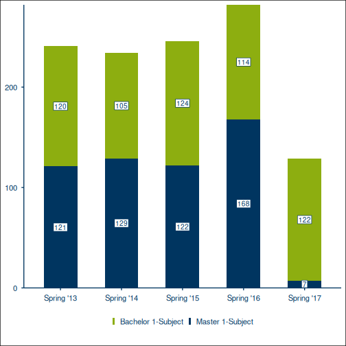

# Knits an R source file contained in the examples folder of a package

Knits an R source file contained in the examples folder of a package

## Usage

``` r
run_example_as_chunk(example_file, chunk_name, package = "RUBer")
```

## Arguments

- example_file:

  Character, name of the R script file with the example

- chunk_name:

  Character, name of the code chunk when knitting

- package:

  Character, name of the package

## Value

Character, text to be inserted in the Markdown file

## Examples

``` r
RUBer:::run_example_as_chunk(
  example_file = "rub_plot_type_1.R",
  chunk_name = "rub-plot-type-1",
  package = "RUBer"
)
#> [1] "\n``` r\n# Create test values for all three mandatory variables (x_var, y_var, fill_var).\ndf_t1_ex1 <- tibble::tribble(\n  ~term, ~students, ~degree,\n  \"Spring '13\", 120, \"Bachelor 1-Subject\",\n  \"Spring '14\", 105, \"Bachelor 1-Subject\",\n  \"Spring '15\", 124, \"Bachelor 1-Subject\",\n  \"Spring '16\", 114, \"Bachelor 1-Subject\",\n  \"Spring '17\", 122, \"Bachelor 1-Subject\",\n  \"Spring '13\", 121, \"Master 1-Subject\",\n  \"Spring '14\", 129, \"Master 1-Subject\",\n  \"Spring '15\", 122, \"Master 1-Subject\",\n  \"Spring '16\", 168, \"Master 1-Subject\",\n  \"Spring '17\", 7, \"Master 1-Subject\",\n)\n\n# x_var is mapped to term, y_var to students, and the fill_var to degree.\n# base_size increases the text sizes from the default, 11, to 14. The font\n# family is changed from \"RubFlama\" to \"sans\" (available on all systems).\nrub_plot_type_1(\n  df = df_t1_ex1,\n  x_var = term,\n  y_var = students,\n  fill_var = degree,\n  base_size = 14,\n  base_family = \"sans\"\n)\n```\n\n\n"
```
